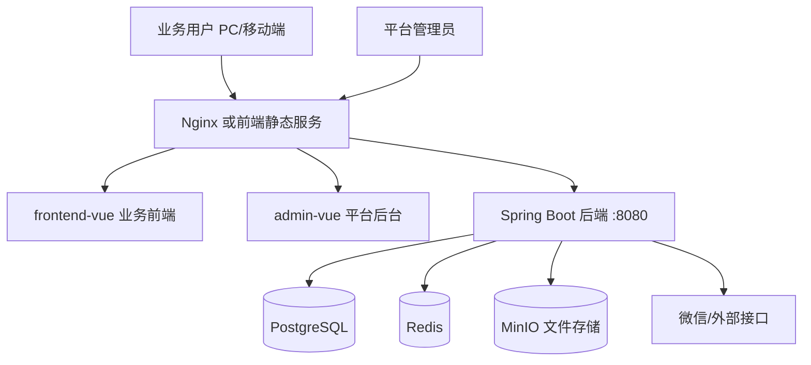

# 系统全景图

## 1. 总体架构

生产/测试环境通常由 Nginx 统一暴露入口：

- `/`：业务前端。
- `/mobile/`：业务前端移动端入口。
- `/admin/`：平台后台。
- `/api/`、`/auth/`、`/actuator/`：反向代理到后端。

## 2. 前端组成

### 业务前端 `frontend-vue/`

面向经销商、医院、业务人员等日常用户，包含：

- `src/api/`：后端接口调用封装。
- `src/router/`：业务路由。
- `src/store/`：Pinia 状态管理。
- `src/layout/`：页面框架。
- `src/views/order/`：订单相关页面。
- `src/views/product/`：产品相关页面。
- `src/views/hospital/`：医院相关页面。
- `src/views/mobile/`：移动端页面。
- `src/components/`：公共组件。
- `src/utils/`、`src/composables/`：工具和组合式逻辑。

开发端口：`5173`。

### 平台后台 `admin-vue/`

面向平台运营/系统管理员，包含：

- `src/views/tenant/`：租户管理。
- `src/views/auth/`：后台账号/权限相关。
- `src/views/dict/`：字典配置。
- `src/views/config/`：系统配置。
- `src/views/log/`：日志查看。
- `src/views/reports/`：报表配置或查看。

开发端口：`5174`，Vite `base` 为 `/admin/`。

## 3. 后端组成

后端入口为 `backend/src/main/java/com/dms/DmsApplication.java`，主要包职责如下：

- `security/`、`auth/`、`adminauth/`：认证登录、JWT、后台认证。
- `rbac/`、`authz/`：角色、权限、授权校验。
- `tenant/`：多租户上下文和租户隔离。
- `user/`：用户信息与用户管理。
- `org/`、`platform/`、`system/`：组织、平台和系统级能力。
- `masterdata/`：产品、经销商、仓库、医院、区域等主数据。
- `contract/`：合同申请、审批、PDF 等。
- `order/`：订单业务。
- `promotion/`：促销引擎。
- `execution/`：执行单/履约相关。
- `inventory/`：库存、收货、移库、调整、盘点。
- `sales/`：销售出库、分账、红冲。
- `rma/`：退换货。
- `invoice/`：发票。
- `report/`：报表和图表。
- `home/`：工作台首页。
- `notification/`：消息通知。
- `operationlog/`、`apilog/`、`aspect/`：操作日志、接口日志和切面。
- `integration/`、`openapi/`：外部系统集成和开放接口。
- `common/`、`config/`、`annotation/`、`entity/`、`mapper/`、`service/`、`controller/`：公共能力和基础设施。

## 4. 数据和迁移

- 默认数据库：PostgreSQL，数据库名默认为 `dms`。
- 测试 profile 使用数据库 `dms_test`。
- 数据库迁移目录：`backend/src/main/resources/db/migration/`。
- 本地 profile 开启 Flyway；默认 `application.yml` 中 `spring.flyway.enabled=false`。
- JPA 配置为 `ddl-auto: none`，正式 schema 变更必须通过 Flyway 迁移脚本完成。

新增数据库脚本时必须注意：

- 版本号不能重复。
- 不能修改已经发布过的 V 脚本。
- 需要考虑多租户字段、权限菜单、字典数据和历史数据兼容。
- 涉及数据修复时，先在测试环境验证并备份。

## 5. 认证和权限

系统包含业务端用户和平台后台账号两类身份。主要机制：

- 登录成功后签发 JWT。
- 前端请求在 Authorization 头中携带 Token。
- 后端通过 Spring Security 和自定义授权逻辑校验接口权限。
- 菜单、按钮、接口权限和角色数据在数据库中维护。
- 多租户场景下必须确认查询和写入是否带租户条件。

接管人员必须优先掌握：

- Token 如何生成和失效。
- 接口权限标识如何定义。
- 菜单权限如何入库。
- 数据权限和租户过滤在哪里生效。

## 6. 文件和外部依赖

### Redis

用途包括缓存、分布式锁或会话相关能力。需要关注：

- 连接地址和密码。
- 使用的 database。
- 锁 key 的命名和过期时间。
- 清空 Redis 前必须确认影响范围。

### MinIO

用途包括合同 PDF、附件或导入导出文件。需要关注：

- endpoint、access key、secret key、bucket。
- 文件访问路径。
- bucket 生命周期和备份策略。

### 微信/外部接口

配置项包括 `WECHAT_APP_ID`、`WECHAT_APP_SECRET`。本地配置中 `mock-enabled: true`，生产环境必须确认真实凭证和调用地址。

## 7. 关键源码入口

- 后端配置：`backend/src/main/resources/application*.yml`
- 后端启动类：`backend/src/main/java/com/dms/DmsApplication.java`
- 安全配置：`backend/src/main/java/com/dms/security/`
- 数据库迁移：`backend/src/main/resources/db/migration/`
- 业务前端配置：`frontend-vue/vite.config.js`
- 平台后台配置：`admin-vue/vite.config.js`
- Nginx 示例：`frontend-vue/nginx-vue.conf`
- API 文档：`docs/06_API设计/`
- 数据库设计：`docs/05_数据库设计/`
- 部署资料：`docs/07_部署方案/`
