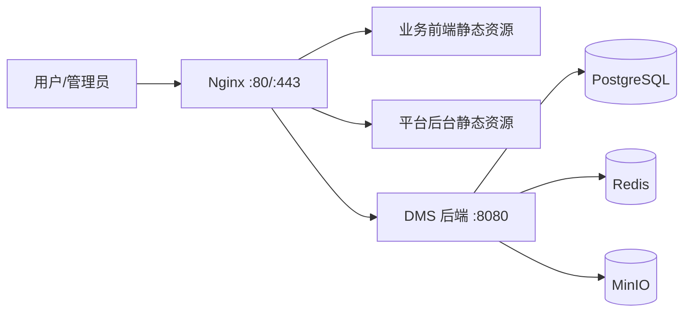

# 运维部署手册

## 1. 部署资产清单

接管时必须从服务器、历史运维人员或备份中收集并归档以下资产：

- `docker-compose.yml` 或实际容器编排文件。
- 后端镜像构建方式和镜像仓库地址。
- 前端构建产物发布目录。
- Nginx 配置文件。
- 环境变量文件或 systemd/容器启动配置。
- PostgreSQL 连接信息、备份脚本和备份目录。
- Redis 配置和密码。
- MinIO 数据目录、bucket 和访问密钥。
- 域名、端口、HTTPS 证书和防火墙规则。
- 外部接口凭证，例如微信、第三方订单或发票接口。
- 日志目录、监控地址和告警联系人。

当前仓库中未找到可直接使用的 `docker-compose.yml`，这是最高优先级补齐项。

## 2. 推荐部署拓扑



Nginx 应承担：

- 静态资源托管。
- `/api/`、`/auth/`、`/actuator/` 反向代理。
- `/admin/` 后台入口。
- 上传大小限制，当前示例配置为 `client_max_body_size 30m`。
- HTTPS 证书配置。

后端默认端口为 `8080`。业务前端开发端口为 `5173`，平台后台开发端口为 `5174`，这两个端口不应对外直接暴露。

## 3. 关键环境变量

后端支持以下主要环境变量：

| 变量名 | 默认值 | 生产要求 |
| --- | --- | --- |
| `DB_HOST` | `localhost` | 必须指向生产数据库 |
| `DB_PORT` | `5432` | 按实际环境设置 |
| `DB_NAME` | `dms` | 生产/测试库名分离 |
| `DB_USER` | `dms` | 使用最小权限账号 |
| `DB_PASSWORD` | `dms123456` | 必须替换为强密码 |
| `REDIS_HOST` | `localhost` | 必须指向生产 Redis |
| `REDIS_PORT` | `6379` | 按实际环境设置 |
| `REDIS_PASSWORD` | 空 | 生产必须设置密码 |
| `REDIS_DB` | `0` | 避免和其他系统混用 |
| `MINIO_ENDPOINT` | `http://localhost:9000` | 使用生产可达地址 |
| `MINIO_ACCESS_KEY` | `minioadmin` | 必须替换 |
| `MINIO_SECRET_KEY` | `minioadmin` | 必须替换 |
| `MINIO_BUCKET` | `dms` | 按实际 bucket 设置 |
| `JWT_SECRET` | 内置默认值 | 生产必须替换成长随机串 |
| `SEED_ENABLED` | `true` | 生产通常应为 `false` |
| `WECHAT_APP_ID` | `mock_appid` | 接入真实微信时替换 |
| `WECHAT_APP_SECRET` | `mock_secret` | 接入真实微信时替换 |

生产环境必须覆盖默认密码和 JWT 密钥。不要把 `.env`、私钥或密码提交到 Git。

## 4. 构建和发布

### 后端发布流程

1. 在 `backend/` 执行构建。
2. 生成 Jar 或 Docker 镜像。
3. 推送到镜像仓库或上传到服务器。
4. 在测试环境使用生产近似配置启动。
5. 检查健康检查、日志和核心接口。
6. 按相同版本发布到生产。
7. 发布后执行冒烟测试。

示例打包命令：

```powershell
cd backend
mvn clean package -DskipTests
```

### 前端发布流程

业务前端：

```powershell
cd frontend-vue
npm ci
npm run build
```

平台后台：

```powershell
cd admin-vue
npm ci
npm run build
```

发布时注意：

- 业务前端构建产物发布到 Nginx 的主站点目录。
- 平台后台产物发布到 `/admin/` 对应目录。
- 保留上一版本产物，便于快速回滚。
- 发布后清理浏览器缓存或确认静态资源 hash 生效。

## 5. 健康检查

发布后至少检查：

- `http://后端地址/actuator/health`
- 业务前端登录页。
- 平台后台登录页。
- 登录接口。
- 一个核心列表查询接口。
- 文件上传或下载接口。
- Nginx access/error 日志。

健康检查不要只看进程存在，还要验证数据库连接、Redis 连接和真实接口可用。

## 6. 日志位置

需要在实际服务器上确认并记录以下日志路径：

- 后端应用日志。
- 后端容器日志：`docker logs <container>`。
- Nginx access 日志。
- Nginx error 日志。
- PostgreSQL 日志。
- Redis 日志。
- MinIO 日志。
- 系统定时任务日志。
- 备份脚本日志。

后端日志配置位于：

- `backend/src/main/resources/logback-spring.xml`

如果生产使用容器，日志需要配置采集或挂载到宿主机，避免容器删除后日志丢失。

## 7. 备份策略

### 数据库备份

建议：

- 每天至少一次全量备份。
- 发布前手动备份一次。
- 执行数据修复脚本前手动备份一次。
- 备份文件保留 7 到 30 天，按业务要求调整。
- 定期把备份复制到另一台机器或对象存储。
- 每季度至少做一次恢复演练。

PostgreSQL 示例备份命令：

```bash
pg_dump -h <host> -U <user> -d dms -F c -f dms_$(date +%Y%m%d_%H%M%S).dump
```

恢复前必须确认目标环境，避免误覆盖生产库。

### 文件备份

需要备份：

- MinIO 数据目录。
- 合同 PDF、附件、导入导出文件。
- Nginx 配置和 HTTPS 证书目录。
- 环境变量文件和编排文件。

## 8. 回滚流程

标准回滚步骤：

1. 确认问题版本和上一稳定版本。
2. 暂停发布或停止继续扩散问题。
3. 备份当前数据库和当前版本产物。
4. 回滚后端镜像或 Jar。
5. 回滚前端静态资源。
6. 如果有数据库迁移，判断是否需要回滚数据、补偿数据或降级代码。
7. 重启服务并检查健康状态。
8. 执行冒烟测试。
9. 记录事故时间线和根因。

注意：Flyway 的 V 脚本一旦发布不应修改。需要回滚数据库结构时，应新增补偿迁移或在明确风险后执行人工恢复。

## 9. 监控和告警

建议至少监控：

- 后端进程或容器重启次数。
- `/actuator/health`。
- HTTP 5xx 数量。
- 登录失败次数。
- 接口平均响应时间和慢接口。
- PostgreSQL 连接数、慢查询、磁盘空间。
- Redis 内存、连接数、key 数量。
- MinIO 容量。
- 服务器 CPU、内存、磁盘。
- Nginx 4xx/5xx。
- 定时任务失败。

## 10. 发布检查清单

发布前：

- 已确认变更范围。
- 已在测试环境验证。
- 已准备数据库备份。
- 已准备回滚版本。
- 已确认环境变量。
- 已通知相关用户。

发布后：

- 服务健康检查通过。
- 登录和核心业务通过。
- 日志无新增严重异常。
- 数据库迁移状态正常。
- 文件功能正常。
- 监控无异常尖峰。

---

## v3.10.0 (2026-08-09) 审批流与邮件配置

### 数据库迁移
- V72 新增审批流相关表（approval_templates/nodes/assignees/ccs/instances/tasks/records/cc_records/delegations）。
- V73 注入审批权限资源。后端容器使用 docker-test profile，Flyway enabled=true，重启自动执行迁移。
- 历史兼容：若库里存在旧版简化的 `approval_tasks`/`approval_history` 空表，V72 会先将其重命名为 `_legacy` 以避免冲突。

### 邮件（SMTP）配置
审批通知使用 163 邮箱 SMTP，配置项在后端 `application.yml`：

```
spring:
  mail:
    host: smtp.163.com
    port: 465
    username: vinkinyu@163.com
    password: <163 SMTP 授权码>
    properties:
      mail.smtp.auth: true
      mail.smtp.ssl.enable: true
```

- `password` 填 163 邮箱“客户端授权码”，不是登录密码。
- 生产环境强烈建议改为环境变量注入（如 `MAIL_PASSWORD`），不要将授权码提交到代码库。
- 用户账号必须填写邮箱，否则无法接收审批邮件；手机号必填用于后续飞书对接。

### 飞书（暂缓）
飞书卡片审批需要公网可访问的事件回调地址（如 `/api/approval/feishu/card-action`）。当前测试环境回调未连通，暂仅启用邮件，飞书相关接口预留。