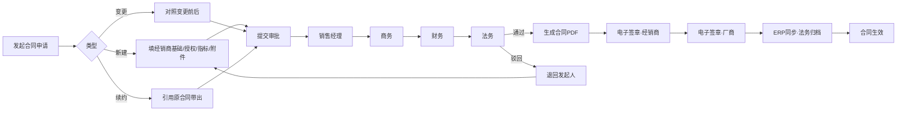
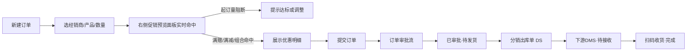
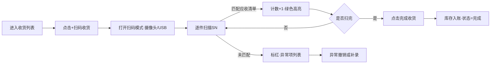
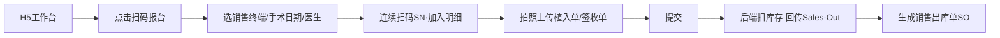

# DMS 通用经销商管理系统 · 高保真 UI 设计说明书

> **文档版本：V3.0**（原 UI 设计规范 V1.0 · v2.0/v3.0 补充见文末链接）
> **⚠️ V3.0 更新**：
> - v2.0 后 UI 演进：[UI设计规范_v1.1.md](../09_测试报告/UI设计规范_v1.1.md) + [UI优化交付报告_v1.1.md](../09_测试报告/UI优化交付报告_v1.1.md)
> - v3.0 新增大屏下单页 + 状态驱动按钮 + 中文详情视图 · 详见 [采购销售拆分+低代码交付报告_v3.0.md](../09_测试报告/采购销售拆分+低代码交付报告_v3.0.md)

> 日期：2026-07-18
> 适用范围：PC Web（1440px 基线）+ H5 移动端（375px 基线）
> 交付目标：设计侧完成 Figma 高保真稿源文件；前端可直接依据本文档进行组件库封装与页面还原。
> 依赖：《补充线框图_低保真原型.md》W-01 ~ W-29 全量升级；参照现有 7 张 PC 设计图（登录 / 工作台 / 订单管理 / 合同管理 / 库存查询 / 经销商画像 / 用户管理）视觉语言。

---

> ## ⚠️ V1 决策变更提示（D-25 / D-28 / D-32 / D-33 / D-36 / D-38）
>
> 本文档保留完整的高保真设计说明作为**长期设计参考**，但 **V1 落地时按以下决策简化**：
>
> | 决策 | 影响 |
> |---|---|
> | **D-25 品牌视觉简化** | V1 **直接采用组件库默认主题**：PC 端 = Element Plus 默认（主色 #409EFF）；H5 端 = Vant 默认。本文档中定义的 `#2C4B8E` 蓝作为参考基色，实际以组件库主色为准。 |
> | **D-38 租户主色可定制** | 保留唯一租户级视觉定制点：`tenants.attrs.primary_color`，前端启动时读租户主色注入 CSS variable 覆盖组件库默认主色。 |
> | **D-28 促销页面简化** | W-13/W-14 页面中 **删除"满赠"与"组合销售"两种类型**，Step 2 规则详情动态渲染只保留 **MOQ（起订量）与 FULL_REDUCTION（满减）**。 |
> | **D-32 删除 SSO** | 登录页 W-01 及登录相关子页 **不再展示"AD/SSO 登录"入口**。 |
> | **D-33 通知渠道** | 消息中心 W-02 不再展示邮件/短信通知通道；改为"站内 + 企微/飞书 Webhook"。 |
> | **D-36 H5 登录** | **W-24 H5 登录页改造**：默认展示"微信扫码登录"大按钮 + 首次扫码后跳"绑定 DMS 账号"页；账号密码作为备用入口收在底部小字。新增 W-24b「H5 绑定 DMS 账号页」占位。 |
>
> **完整 Design Tokens 与组件规范作为长期参考**，V1 直接引用 Element Plus/Vant 内置组件，仅在需要与组件库差异较大的业务场景（例如 W-11 时间轴、W-14 促销预览面板、W-26 扫码收货全屏模式）参考本文档细化设计。
>
> ---

## 一、设计目标与约束

### 1.1 设计目标

DMS 定位为面向医疗器械行业的通用型经销商管理 SaaS，覆盖"合同管理 + 进销存 + 数据报表 + 移动扫码"四大主业务域。高保真 UI 设计需同时满足以下四类使用场景：

1. **后台密集型作业场景**：财务、商务、运营在 PC 端进行大批量单据录入、审批、查询与导出。视觉上追求高信息密度、低视觉噪声、稳定可预测的交互反馈。
2. **决策浏览型场景**：管理层查看 Dashboard、经销商画像、多维报表。视觉上突出数据可视化，允许适度留白与图形语言表达。
3. **一线移动作业场景**：仓管、销售代表在医院、仓库、手术室使用手机扫码收货、报台、查库存。视觉上强调大按钮、大字号、单手可达、弱光可视。
4. **多租户 SaaS 场景**：不同租户在同一套 UI 下可通过品牌色替换、Logo 替换、模块开关差异化呈现，需保证组件可主题化。

### 1.2 核心设计原则

| 原则 | 具体表达 |
|---|---|
| 一致性（Consistency） | 相同语义元素在所有页面表现一致，如"待审批"始终为 `#FAAD14` 橙色 Tag。 |
| 高效率（Efficiency） | 表单页支持 Tab 键顺序录入、快捷键（Ctrl+S 保存、Ctrl+Enter 提交），Grid 列可拖拽/记忆。 |
| 可预测（Predictable） | 危险操作（删除、作废、红冲）二次弹窗确认，且按钮位置固定右下。 |
| 可拓展（Scalable） | Design Tokens 以变量驱动，多租户主题、暗色模式、密度切换可零成本切换。 |
| 可访问（Accessible） | 满足 WCAG 2.1 AA 级色彩对比度与键盘导航要求。 |

### 1.3 约束条件

- **多租户约束**：主色（Primary）需支持租户级动态替换。默认 `#2C4B8E`，切换后组件库自动派生 hover/active/disabled 阶。
- **H5 适配约束**：H5 只承载"扫码类"作业，不承载复杂表单；断点 ≤768px 走 H5 布局。
- **性能约束**：单页初始渲染 ≤3s（1440p + 4G 网络），Table 首屏 20 行 <500ms。
- **无障碍约束**：所有正文文本对比度 ≥4.5:1；大号文本（≥18px 或 14px 粗体）≥3:1。
- **国际化约束**：文本长度按中文 1.5 倍预留（未来英/日切换用），组件不做像素级硬编码宽度。

---

## 二、信息架构与用户流程

### 2.1 顶层信息架构

```
DMS
├─ 工作台（首页）
├─ 合同管理
│  ├─ 合同申请（新建/变更/续约/终止/批量延展/批量更新）
│  ├─ 合同列表 / 电子签章
│  ├─ 主数据（产品/分类/组织/区域/终端/合同负责人）
│  └─ 授权管理（终端/产品线）
├─ 进销存
│  ├─ 采购 / 分销订单
│  ├─ 收货管理（含扫码）
│  ├─ 销售出库（含手术报台）/ 分销出库
│  ├─ 库存查询 / 调整 / 移库 / 借货 / 盘点
│  ├─ 退换货 & RMA 授权
│  ├─ 产品流向追踪
│  ├─ 发票管理
│  └─ 促销管理（起订量/满赠/满减/组合销售）
├─ 数据报表
│  ├─ 综合 Dashboard
│  ├─ 经销商画像
│  └─ 10 类固定报表（合同/订单/库存/销售/授权/借货/发票/返利/折扣/退货）
├─ 消息中心
├─ 系统管理
│  ├─ 用户 / 角色 / 权限
│  ├─ 流程设定（可视化）
│  ├─ 审计日志
│  ├─ 缓存监视 & 手工同步
│  └─ 平台管理（超管租户视图）
└─ 个人中心 / 设置
```

### 2.2 关键用户流程

#### 2.2.1 合同全生命周期



#### 2.2.2 订单 → 促销 → 审批 → 出库



#### 2.2.3 扫码收货流程（PC / H5）



#### 2.2.4 销售报台（手术植入）流程



---

## 三、设计系统 Design Tokens

### 3.1 颜色系统（Color Tokens）

#### 3.1.1 品牌主色（Primary · 蓝）

| Token | HEX | 用途 |
|---|---|---|
| primary-1 | `#EAF0FA` | 最浅底色，Tag 背景、Selected Row 底色 |
| primary-2 | `#C6D4EC` | Hover 底色、进度条底 |
| primary-3 | `#7E97C7` | Disabled 主按钮 |
| primary-4 | `#4E6EAE` | Hover 主按钮 |
| **primary-5** | **`#2C4B8E`** | **默认主色 / 品牌色 / 主按钮 / 激活导航** |
| primary-6 | `#1F3870` | Active 主按钮（按下） |
| primary-7 | `#152655` | 深色导航底 |

#### 3.1.2 功能语义色（Semantic）

| 语义 | 色板 | 6 阶灰度示例 |
|---|---|---|
| **success** 成功 | `#52C41A` | 1:`#F6FFED` 2:`#D9F7BE` 3:`#B7EB8F` 4:`#95DE64` **5:`#52C41A`** 6:`#389E0D` |
| **warning** 警告 | `#FAAD14` | 1:`#FFFBE6` 2:`#FFF1B8` 3:`#FFE58F` 4:`#FFD666` **5:`#FAAD14`** 6:`#D48806` |
| **danger** 危险 | `#F5222D` | 1:`#FFF1F0` 2:`#FFCCC7` 3:`#FFA39E` 4:`#FF7875` **5:`#F5222D`** 6:`#CF1322` |
| **info** 信息 | `#1890FF` | 1:`#E6F7FF` 2:`#BAE7FF` 3:`#91D5FF` 4:`#69C0FF` **5:`#1890FF`** 6:`#096DD9` |

#### 3.1.3 中性色（Neutral · 6 阶灰度）

| Token | HEX | 用途 |
|---|---|---|
| neutral-1 | `#FFFFFF` | 卡片/Modal 背景 |
| neutral-2 | `#F7F8FA` | 页面底色、Table 斑马纹 |
| neutral-3 | `#E5E7EB` | 分割线、Border |
| neutral-4 | `#C5CAD3` | Disabled 边框、Placeholder 图标 |
| neutral-5 | `#8C93A0` | 次要文字、Placeholder |
| neutral-6 | `#4E5566` | 正文次级 |
| neutral-7 | `#1F2937` | 正文主级 / H1 标题 |

### 3.2 字体系统（Typography Tokens）

- 字体族（fallback 链）：`PingFang SC, "Microsoft YaHei", "Helvetica Neue", Roboto, "Segoe UI", sans-serif`
- 数字字体：`Roboto Mono, Menlo, Consolas, monospace`（金额、单号、SN 序列号强制等宽）

| Token | 字号 / 行高 | 字重 | 用途 |
|---|---|---|---|
| font-h1 | 32 / 40 | 600 | 大屏 Dashboard 主 KPI 数值 |
| font-h2 | 24 / 32 | 600 | 页面主标题、Modal 标题 |
| font-h3 | 18 / 26 | 600 | 分组标题、区块标题 |
| font-h4 | 16 / 24 | 500 | 卡片标题、Tab 激活 |
| **font-body** | **14 / 22** | **400** | **正文·默认表格·表单** |
| font-caption | 13 / 20 | 400 | Table 表头、辅助说明 |
| font-mini | 12 / 18 | 400 | Tag、时间戳、脚注 |

### 3.3 间距系统（Spacing · 8 阶栅格）

`4 / 8 / 12 / 16 / 24 / 32 / 48 / 64`（单位 px）

- 组件内间距（Padding）：Input 内边距 8×12；Button 内边距 8×16；Card 内边距 24。
- 组件间间距（Gap）：表单项竖向 24，横向 16；卡片之间 16；页面主内容与卡片 24。
- 页面布局：内容区左右留白 24，卡片间距 16，KPI 行 gap 16。

### 3.4 圆角（Radius）

| Token | 值 | 用途 |
|---|---|---|
| radius-sm | 4px | Button、Input、Tag |
| radius-md | 8px | Card、Modal、Drawer |
| radius-lg | 12px | 大型引导卡、空态插图容器 |
| radius-pill | 999px | Avatar、开关 Track、圆形头像徽标 |

### 3.5 阴影（Shadow · 三阶）

| Token | 值 | 用途 |
|---|---|---|
| shadow-1 | `0 2px 8px rgba(0,0,0,0.05)` | 卡片默认阴影 |
| shadow-2 | `0 4px 16px rgba(0,0,0,0.08)` | Hover 卡片、Dropdown 弹出 |
| shadow-3 | `0 8px 32px rgba(0,0,0,0.12)` | Modal、Drawer、全局提示 |

### 3.6 动效（Motion）

| Token | 时长 | 缓动 | 用途 |
|---|---|---|---|
| motion-fast | 150ms | `cubic-bezier(0.4, 0, 0.2, 1)` | 按钮 hover、Tag 切换 |
| motion-base | 250ms | `cubic-bezier(0.4, 0, 0.2, 1)` | Modal 淡入、Drawer 滑入 |
| motion-slow | 400ms | `cubic-bezier(0.16, 1, 0.3, 1)` | 图表加载、页面切换 |

### 3.7 Z-Index 层级

`Table 固定表头 100 / Dropdown 1000 / Drawer 1200 / Modal 1300 / Toast 1400 / Loading 蒙层 1500`

---

## 四、组件规范

### 4.1 Button 按钮

**类型 × 尺寸矩阵**：4 类型（Primary / Default / Text / Link）× 3 尺寸（Large 40 / Middle 32 / Small 24）× 5 状态（Default / Hover / Active / Disabled / Loading）。

| 类型 | 背景 | 文字 | 边框 | Hover 背景 | Active 背景 | Disabled |
|---|---|---|---|---|---|---|
| Primary | `#2C4B8E` | `#FFFFFF` | 无 | `#4E6EAE` | `#1F3870` | 背景 `#7E97C7` + 文字 `#FFFFFF` |
| Default | `#FFFFFF` | `#1F2937` | `1px solid #E5E7EB` | 文字 `#2C4B8E` + 边框 `#2C4B8E` | 文字 `#1F3870` + 边框 `#1F3870` | 文字 `#C5CAD3` + 边框 `#E5E7EB` |
| Text | 透明 | `#2C4B8E` | 无 | 背景 `#EAF0FA` | 背景 `#C6D4EC` | 文字 `#C5CAD3` |
| Link | 透明 | `#2C4B8E` | 无 | 文字 `#4E6EAE` 下划线 | 文字 `#1F3870` | 文字 `#C5CAD3` |

- Danger 变体：将主色替换为 `danger-5 #F5222D`，用于"删除""作废""红冲"。
- 尺寸：Large 高 40px、圆角 4、字号 14；Middle 高 32px；Small 高 24px、字号 12。
- Loading：左侧 14×14 旋转 icon，禁用点击但不改变颜色（保留原态）。
- Focus：所有类型加 `outline: 2px solid rgba(44,75,142,0.35)` 外描边（非叠加，2px offset）。

### 4.2 Input 输入框

- 尺寸：高 32（默认）、40（大）、24（小）。
- Default：背景 `#FFFFFF`、边框 `#E5E7EB`、文字 `#1F2937`、Placeholder `#8C93A0`。
- Hover：边框 `#7E97C7`。
- Focus：边框 `#2C4B8E` + 阴影 `0 0 0 2px rgba(44,75,142,0.15)`。
- Error：边框 `#F5222D` + 底部 12px 红字提示，抖动动画 200ms（3 次 4px）。
- Disabled：背景 `#F7F8FA`、文字 `#C5CAD3`、cursor `not-allowed`。
- 前后缀图标：14×14 灰色 `#8C93A0`，Hover 主色。
- 字数限制：右下角 `12/50` 灰色小字，超限红字。

### 4.3 Select 下拉

- 触发器与 Input 同尺寸同状态；右侧 12×12 chevron 图标。
- Dropdown Panel：`shadow-2`、圆角 8、最大高 256px、内 padding 4。
- Option：高 32、左内边距 12；Hover 底 `#EAF0FA`；Selected 底 `#EAF0FA` 文字 `#2C4B8E` + 右侧勾选。
- 多选：Tag chip 8×4 内边距、可关闭 × 图标；超过 3 个折叠为 `+N`。
- 搜索：顶部内嵌 Input，实时过滤 debounce 200ms。

### 4.4 Table 表格

- 行高：紧凑 40 / **默认 48** / 宽松 56。
- 表头：底 `#F7F8FA`、字号 13、字重 500、文字 `#4E5566`；支持排序（升/降/无）三态图标。
- 行 Hover：底 `#F7F8FA`；Selected：底 `#EAF0FA`。
- 斑马纹：可选，偶数行底 `#FAFBFC`。
- 边框：仅横向 1px `#F0F1F5`；无竖线（除固定列分界处 1px `#E5E7EB`）。
- 固定列/表头：`box-shadow: 2px 0 6px rgba(0,0,0,0.04)` 表示分界。
- 操作列：右侧固定，Text Button 之间以 `#E5E7EB` 竖线 12px 高分隔。
- 空态：Table 内嵌 Empty 组件，高 240，插图 120×120 + 描述 + CTA。
- 加载态：整体 `#FFFFFF66` 蒙层 + 中心 Spin 24px。
- 展开行：左侧 chevron 12×12 旋转 150ms。

### 4.5 Card 卡片

- 背景 `#FFFFFF`、圆角 8、阴影 `shadow-1`、内边距 24。
- Header：字号 16 / 500 / `#1F2937`，可带右侧操作区。
- Divider：`1px solid #F0F1F5`，间距 16。
- Hover（可点击卡片）：升 shadow-2、上移 -2px、150ms。

### 4.6 Tag / Badge 标签徽标

**Tag（矩形圆角 4，高 22，字号 12，padding 8×4）**：

| 状态语义 | 文字 | 底色 | 边框 |
|---|---|---|---|
| 默认 | `#4E5566` | `#F7F8FA` | `#E5E7EB` |
| 处理中 / 待审批 | `#D48806` | `#FFFBE6` | `#FFE58F` |
| 成功 / 已完成 | `#389E0D` | `#F6FFED` | `#B7EB8F` |
| 失败 / 作废 | `#CF1322` | `#FFF1F0` | `#FFA39E` |
| 进行中 / 生效 | `#096DD9` | `#E6F7FF` | `#91D5FF` |
| 主要 | `#1F3870` | `#EAF0FA` | `#C6D4EC` |

**Badge**：右上角红点 8×8 或数字徽标（12×高，min-width 16，字号 10 白字）。

### 4.7 Modal 模态框

- 宽度：Small 400 / Middle 520 / Large 720 / X-Large 960。
- 圆角 8、阴影 shadow-3、遮罩 `rgba(0,0,0,0.45)`。
- Header：高 56、左 padding 24、标题 16/500、右 × 图标 hover 主色。
- Body：padding 24、最大高度 `calc(100vh - 200px)`，内容超出滚动。
- Footer：高 56、右对齐、`取消`（Default）+ `确认`（Primary），间距 8。
- 危险 Modal：Header 左侧红色 icon 20×20 `#F5222D`。
- 动画：淡入 + 缩放 0.9→1、250ms。

### 4.8 Drawer 抽屉

- 位置：右侧（默认）、左侧、顶部、底部。
- 宽度档位：Small 400 / **Middle 560 / Large 720**（详情用 Middle，编辑用 Large）。
- 阴影 shadow-3、圆角仅接口侧 0，其他侧不圆角。
- Header 60、Body 满高、Footer 64 固定底部按钮组。
- 滑入 250ms `cubic-bezier(0.4,0,0.2,1)`。

### 4.9 Toast / Message

- 位置：顶部居中 24px 下沿。
- 尺寸：高 40、min-width 240、圆角 4、阴影 shadow-2。
- 类型色：success（绿）/ error（红）/ warning（橙）/ info（蓝），左侧 4px 色条 + 16×16 icon。
- 停留：3s 后淡出 250ms；error 保持 5s。
- 手动关闭 × 可选。

### 4.10 Steps 步骤条

- 水平：节点圆 24 + 标题 14 + 描述 12；连接线 1px。
- 竖直：节点圆 24 + 标题 14；连接线 2px 竖。
- 状态色：完成（`#2C4B8E` 底 + 白勾）、进行中（`#2C4B8E` 描边 + 白底 + 蓝数字）、未开始（`#C5CAD3` 描边 + 白底 + 灰数字）、错误（`#F5222D` 底 + 白 ×）。

### 4.11 Tabs 标签页

- 高度 40，字号 14；激活项 `#2C4B8E` + 底部 2px 高亮线；未激活 `#4E5566`。
- Hover：文字色 `#4E6EAE`。
- Disabled：`#C5CAD3`。
- 数字徽标：右上 8×8 红点（未读）或圆角矩形数字（≤99+）。

### 4.12 Pagination 分页

- 高 32，按钮 32×32，圆角 4；当前页背景 `#2C4B8E` 白字，其他透明 `#4E5566`。
- 快捷跳转输入框宽 60，右侧`跳至`两字。
- Page Size 选择器：默认 20，可选 10 / 50 / 100。

### 4.13 Upload 上传

- 拖拽区：160×160（图片）或 480×120（文件），虚线 `#C5CAD3`，Hover 主色。
- 图片墙：96×96 缩略图，右上角 × 悬浮显示，Hover 覆盖遮罩 + 放大/删除。
- 上传中：进度条 4px 高，蓝色。
- 支持格式：Image `JPG/PNG/GIF ≤5MB`；Doc `PDF/DOC/XLS ≤20MB`。
- 医疗器械附件：单独灰色说明"植入单/签收单必传"。

### 4.14 Avatar 头像

- 尺寸：32 / 40 / 48；圆形，字母缩写背景 `#2C4B8E` 白字，或图片。
- 组：重叠 -8px，超出显示 +N。

### 4.15 空态 / 加载态 / 错误态

**Empty 空态**：120×120 灰度插图 + 14/400 描述 + 可选 CTA 按钮。

| 场景 | 主文案 | 副文案 | CTA |
|---|---|---|---|
| 无数据 | 暂无数据 | 试试调整筛选条件 | — |
| 无权限 | 暂无权限 | 请联系管理员开通 | 联系管理员 |
| 首次使用 | 开始你的第一个订单 | — | 新建订单 |

**Loading**：Spin 24×24 主色旋转 1s / 环 + 骨架屏 Skeleton（灰阶 shimmer 效果 1.4s 循环）。

**Error 错误页**：500 / 403 / 404 全屏，居中插图 240×240 + 主标题 24/600 + 描述 14 + 返回按钮。

---

## 五、29 张页面高保真设计说明

> 说明：以下每张页面均按"页面尺寸→区域布局→主要组件与状态→微交互→边界场景"五段式给出规范，直接可编码实现。

### W-01 忘记密码 / 重置密码

| 维度 | 规格 |
|---|---|
| 页面尺寸 | 1440×900 单屏无滚动 |
| 区域布局 | 左品牌区 60%（渐变 `#1F3870→#2C4B8E`，居中 Logo 240×80 + 副标语 24/500 白字）+ 右表单区 40%（`#FFFFFF`，居中 420 宽表单卡） |
| 主要组件 | H2 标题"重置密码"、说明文字 14/`#4E5566`、Input（邮箱）、Captcha 图形验证码 96×32 + 刷新按钮、Primary Button 40 高全宽"发送重置邮件"、Link "← 返回登录" |
| 微交互 | 邮箱输入实时正则校验（失焦 300ms）；验证码点击刷新旋转 250ms；发送成功→Toast 3s 后跳转 |
| 边界场景 | 邮箱未注册→Input 红边框 + 12/`#F5222D`"该邮箱未注册"；验证码错误→抖动 3 次；Token 失效→整页替换"链接已过期"插图 240×240 + 重新发送按钮 |

**Step2 设置新密码**：420 宽卡片，密码强度条 4 段（弱红/中橙/强黄/优绿），实时评估位数+字符类型；新密码与确认密码不一致时确认框红边框。

### W-02 消息中心

| 维度 | 规格 |
|---|---|
| 页面尺寸 | 1440×900，面包屑 60 + 内容 |
| 区域布局 | 顶部 Tabs 高 48（全部/未读/待办/系统/公告，数字徽标）+ 操作区 40（右对齐"标记全部已读""删除已读"Text Button）+ 消息列表（左 800）+ 右侧详情 Drawer 560 |
| 消息 Item | 高 72，左圆点（未读 `#2C4B8E` 8×8 / 已读透明）+ 图标 24×24（订单/合同/库存/公告分色）+ 标题 14/500 + 摘要 13/`#8C93A0` + 时间 12/`#8C93A0` + 右侧 Text Button [查看] |
| 微交互 | Hover 底 `#F7F8FA`；点击→右侧 Drawer 滑入 250ms 展示详情；详情底部"跳转到源单据"Primary Button |
| 边界场景 | 空态：120 插图"暂无消息"；超长标题单行省略号；1000+ 条虚拟滚动 |

### W-03 收货管理 & 扫码收货

| 维度 | 规格 |
|---|---|
| 页面尺寸 | 1440×900 |
| 区域布局 | 面包屑 60 + 筛选卡（收起 100 / 展开 200）+ 操作栏 48 + Table + Pagination 56 |
| 筛选卡 | 4 列 Grid，label 上方 12/`#4E5566`，Input/Select 高 32；右下 [查询 Primary] [重置 Default] |
| Table 列 | ☑ / 收货单号（可点击链接色）/ 类型 Tag / 关联出库 / 发货方 / 应收/实收（分数样式蓝色）/ 状态 Tag / 操作（详情/确认/撤销） |
| 扫码 Modal | 960×640 大 Modal：左 480 摄像头预览黑底 + 十字瞄准框 240×240 白框 + 底部"已扫 3/10 件"18/600 白字 + 右 480 已扫清单 Table（SN / 产品 / 状态 icon）+ 异常项 tab 红色徽标 |
| 微交互 | 每扫一件→绿色边框闪一次 400ms + 提示音；未匹配 SN→红色边框 + 顶部 Toast error |
| 边界场景 | 摄像头无权限→提示"请授予相机权限"+ 手动输入切换；网络断开→本地缓存 SN，恢复后批量上报 |

### W-04 销售出库单（含手术信息）

| 维度 | 规格 |
|---|---|
| 页面尺寸 | 1440×900 |
| 区域布局 | 顶部单据信息条 64（单号/状态 Tag/[保存][提交]）+ Tabs 高 48（基本/手术/明细/附件）+ 表单主区 + 底部固定操作条 64（阴影 shadow-2 上翻） |
| 表单栅格 | 24 列栅格，Item 竖向 gap 24、横向 gap 16；label 左对齐 96 宽，Input 剩余 |
| 手术信息 Tab | 植入单号（20 位 SN 校验）/ 医生 Select（可搜索）/ 科室 / 手术类型 / 手术日期 DatePicker / 患者姓名 / 性别 Radio / 年龄 / 疾病 |
| 明细行 | Table 内嵌可编辑，行高 56；仓库 Select、产品 Select（远程搜索）、SN Input（右侧扫码 icon）、批号、数量、生产日期、有效期；行尾删除 icon |
| 附件 Tab | 上传区 480×160，虚线框，"拖拽或点击上传植入单/客户签收单"；已上传缩略图墙 |
| 微交互 | 提交前全字段校验；提交 loading 按钮；红字冲销单标题背景 `#FFF1F0` |
| 边界场景 | 库存不足→行末红字提示；同一 SN 重复扫描→顶部 Toast warning |

### W-05 分销出库单

| 维度 | 规格 |
|---|---|
| 区域布局 | 表单页与 W-04 同结构，Tabs 简化为"基本/明细/物流" |
| 关键点 | 关联下游订单 Select 只读带出、借入方经销商只读、明细可修改批号/序列号、快递单号必填 |
| 提交后 | 顶部状态 Tag 变"已发出"，下游 DMS 触发 SSE 生成"待接收"通知 |

### W-06 退换货 & RMA 授权

| 维度 | 规格 |
|---|---|
| 区域布局 | Tabs：RMA 授权 / 退换货申请 |
| RMA 授权列表 | Table 列：授权号 / 经销商 / 产品线 / 授权额度（金额右对齐 Roboto Mono）/ 已使用（进度条 60×8 + 百分比）/ 剩余 / 状态 Tag / 操作 |
| 新建授权表单 | Modal 720 宽：经销商/产品线/额度/有效期起止（DatePicker Range，最长 2 年）/ 原因 / 附件 |
| 退换货详情 | 上半：引用信息卡；中：明细 Table；下：时间轴（Steps 竖直 8 步） |
| 微交互 | 额度不足→额度输入框红边 + 提示；时间轴当前节点脉冲呼吸 2s 循环 |

### W-07 库存调整

| 维度 | 规格 |
|---|---|
| 列表页 | 与 W-03 同结构 |
| 新建表单 | Modal 720：调整类型分组 Radio（增加类 4 项 / 扣减类 4 项，选中后底 `#EAF0FA`）+ 仓库 Select + 明细 Table + 附件 |
| 提交规则可视化 | 类型下方 12/`#4E5566` 提示"增加类需商务审批，扣减类提交即生效" |
| 状态 | 增加类先显"待审批"Tag 橙色；扣减类直接"完成"Tag 绿色 |

### W-08 移库单

| 维度 | 规格 |
|---|---|
| 表单 | Modal 640：源仓库 Select + 目标仓库 Select（选相同→红字校验）+ 明细 Table |
| 已提交 | 显示"生效"Tag 蓝色；操作栏 [撤销] 二次确认 Modal → 生成反向移库自动关联 |

### W-09 借货出/入库

| 维度 | 规格 |
|---|---|
| 借出方视角 | 表单类似 W-05，提交后状态"待借入方确认" |
| 借入方视角 | 待办卡片右上角红色徽标；点击进入"确认收货"页，明细可核对不可改（只能整单确认或拒收） |
| 归还流程 | 从借入单列表→[发起归还]→生成反向单据流转 |

### W-10 月末库存盘点上传

| 维度 | 规格 |
|---|---|
| 区域布局 | 顶部当前月份大标题 32/600 + 上报窗口进度条 8 高（今日/最后期限）+ 剩余天数倒计时 KPI 卡 |
| 中部 | 3 个大按钮 240×80：[下载模板]（Default）[上传盘点表]（Primary）[查看差异报告]（Text） |
| 未完成单据提示 | Warning Alert 组件（黄底 `#FFFBE6`），列出待办清单，可点击跳转 |
| 差异报告 Table | 差异列绝对值 ≥5% 时行底 `#FFF1F0`，差异率负数红色、正数绿色 |
| 边界场景 | 未在窗口期→上传按钮 Disabled，提示"未到上报窗口" |

### W-11 产品流向追踪

| 维度 | 规格 |
|---|---|
| 查询区 | 三列：产品编码/批号/序列号，[查询][重置] |
| 时间轴 | 竖直 Steps 变体：节点圆 16 + 时间戳右侧 + 卡片式内容（发货方/收货方/关联单号）+ 连接线 2px 虚线 |
| 关键节点色 | 厂商发货蓝、经销商入库紫、移库橙、销售出库绿、完成灰 |
| 操作 | 底部 [导出 Excel][导出 PDF][上报监管平台]，最后一个 Primary |
| 边界场景 | 未找到→空态"该序列号无流向记录" |

### W-12 发票管理

| 维度 | 规格 |
|---|---|
| Tabs | 采购发票 / 销售发票 |
| Table 列 | 发票号（等宽字体）/ 关联订单（链接）/ 金额（右对齐 Roboto Mono）/ 税额 / 开票日期 / 上传日期 / 状态 Tag / 操作 |
| 上传表单 | Drawer 560 宽：发票号 / 关联订单 Select（远程搜索仅"已确认"）/ 开票日期 / 金额 / 税额 / 税率（自动计算）/ 图片上传 |
| 批量上传 | Modal 720：拖拽 Excel + zip 图片包，进度条实时；失败行 Table 展示红色可下载重传 |

### W-13 促销规则列表 & 创建

| 维度 | 规格 |
|---|---|
| 列表 | Table 增加"优先级"列（1-100 数字条形化：细蓝条按比例）+ "时间窗"列进度条（当前时间指示） |
| 新建向导 | Modal 全屏或独立页，顶部 Steps 4 步：基本信息 / 规则详情 / 附件备注 / 提交 |
| Step2 规则详情 | 按类型动态渲染：起订量（简单表单）/ 满赠（阶梯 Editor：新增档次按钮 + 每档赠品明细 Table）/ 满减（阶梯滑块 + 阶梯 Table）/ 组合销售（拖拽产品到组合区） |
| 交互亮点 | 阶梯 Editor 支持 [+ 新增档次]、[删除档次]、"复制上一档" |
| 边界场景 | 时间窗与已有促销冲突→黄色 Warning Alert 展示冲突列表 |

### W-14 促销预览面板（订单页内嵌）

| 维度 | 规格 |
|---|---|
| 位置 | 订单编辑页右侧固定 Drawer-lite，宽 320，顶部距离顶栏 60 |
| 卡片 | 每条命中一张 88 高卡：左 icon（满赠礼盒/满减折扣/套餐箱/阻断警告）+ 促销名 14/500 + 优惠金额 16/600 绿色 |
| 距离下一档提示 | 灰色卡+进度条+CTA "加购推荐产品"跳转 |
| 阻断项 | 红底 `#FFF1F0` + 红字，不可提交订单 |
| 底部合计 | 固定条：优惠合计 / 实付金额 18/700 主色 |

### W-15 主数据管理（通用模板）

| 维度 | 规格 |
|---|---|
| 区域布局 | 左侧树 280 宽（背景 `#F7F8FA`）+ 右侧表格主区 |
| 树 | Item 高 36，缩进 16 每层，chevron 12×12；选中项底 `#EAF0FA` 文字主色 |
| 表格 | 顶部条件筛选 + [+ 新增] [导入] [导出] [批量停用] 操作栏 |
| 新增/编辑 | Drawer 720 宽，按主数据类型动态渲染字段 |
| 停用校验 | 若被下游引用→Modal 展示引用清单 Table + "无法停用"按钮 disabled |
| 导入模板 | Excel 模板下载 + 上传→预览 Modal 显示前 100 行 + 失败行标红 |

### W-16 合同申请向导

| 维度 | 规格 |
|---|---|
| 布局 | 顶部 Steps 7 步 + 主表单区 + 底部 [上一步][下一步][保存草稿][提交] |
| Step1 类型选择 | 6 张 240×160 大卡片，选中态：主色描边 2px + 右上角勾选 icon + 底 `#EAF0FA` |
| Step6 变更对照 | 左右分栏 Table：变更前列灰底、变更后列白底，差异行黄底左边条 `#FAAD14` |
| 提交 | Primary Button [提交审批] 触发全字段校验，失败自动定位第一个错误 Step + 该字段焦点 |

### W-17 电子签章流程

| 维度 | 规格 |
|---|---|
| Step1 签章预览 | PDF 内嵌预览 iframe 900 高，右侧关键条款高亮抽屉（Sticky） |
| Step2 身份验证 | 表单卡片 480 宽：手机号只读 + 短信验证码 Input 6 位分格 + 60s 倒计时 [发送] Button |
| Step3 签章完成 | 大绿色成功图标 120 + CA 流水号复制 + 签章时间戳 + [返回合同]  |
| 拒签流程 | 弹 Modal 必填拒签原因（Textarea 200 高）+ 确认二次弹窗 |
| 微交互 | 短信验证码输入自动跳格；倒计时结束按钮变可点击 |

### W-18 固定报表页（通用模板）

| 维度 | 规格 |
|---|---|
| 布局 | 面包屑 + 折叠筛选（默认展开）+ 图表切换 Tabs + 图表主区 + 数据 Table + 操作栏 |
| 筛选 | 4 列 Grid，右下 [查询][重置][保存当前查询] |
| 图表 Tabs | [柱状图][折线图][饼图][数据表] |
| 图表规格 | ECharts / AntV G2；主色板：`#2C4B8E #52C41A #FAAD14 #F5222D #1890FF #722ED1`；容器高 360、留白 24 |
| 表格下钻 | 单元格可点击行→打开经销商画像或订单详情 Drawer |
| 导出订阅 | [Excel][PDF][订阅邮件]（订阅走 Modal：频率日/周/月 + 收件人多选） |

### W-19 综合 Dashboard

| 维度 | 规格 |
|---|---|
| 布局 | 面包屑 + 时间维度 Radio Group（今日/本周/本月/本季/本年/自定义）+ 5 Row 卡片流 |
| Row1 KPI | 6 张 KPI 卡（宽 (1440-24×2-16×5)/6 ≈ 216），标题 13/`#8C93A0` + 主数值 32/600 主色 + 环比小 icon（↑绿/↓红）+ 描述 12 |
| Row2 | 左 720 折线图（Sales 趋势）+ 右 704 双柱图（达成 TOP10 / BOTTOM10） |
| Row3 | 中国地图热力 1440，高 480，右上角切换 [销售/库存/经销商密度] |
| Row4 | 左右 720：串货预警 Table + 临期库存 Table |
| Row5 | 雷达图 720 + 达成明细 Table 720 |
| 交互 | 所有元素点击→跳转下钻页面；hover Tooltip 卡片 shadow-2 |

### W-20 流程设定

| 维度 | 规格 |
|---|---|
| 布局 | 左侧流程列表 280（合同/订单/库存/退换货/促销/RMA）+ 右侧可视化画布 |
| 画布 | 类 BPMN 流程节点：矩形 160×64 圆角 8，起始节点圆形 48，条件菱形 96×96 |
| 节点连线 | 折线路径带箭头，Hover 高亮蓝色 |
| 属性面板 | 右侧 Drawer 400 宽（点击节点触发）：审批人配置、字段可见性、超时时间、抄送人 |
| 版本管理 | 顶部 [保存草稿][发布][历史版本 v2.3] |

### W-21 审计日志

| 维度 | 规格 |
|---|---|
| 布局 | 条件筛选 + Table + 详情 Modal |
| Table 列 | 时间（等宽）/ 操作人（Avatar+名字）/ 类型 Tag（CREATE蓝 UPDATE橙 DELETE红 LOGIN 灰）/ 资源 / 说明 / IP / 操作 |
| 详情 Modal | 720 宽：JSON diff 双列（前值 / 后值），差异行黄底、新增绿底、删除红底 |

### W-22 缓存监视 & 手工同步

| 维度 | 规格 |
|---|---|
| 布局 | Grid 2×2 主数据卡片 + 任务队列 Table |
| 主数据卡 | 高 160、状态图标（绿勾/橙圆点）+ 上次同步时间 + [立即同步] Primary Button |
| 同步中 | 卡片顶部进度条 4 高蓝色跑马、按钮变 Loading |
| 任务队列 | 实时 SSE 刷新，进度列动画 |

### W-23 多租户平台管理

| 维度 | 规格 |
|---|---|
| 权限 | 仅超管可见，顶部 Alert 提示"平台管理员视图" |
| Table 列 | 租户 ID / 名称（含 Logo 32×32）/ 行业 / 联系人 / 用户数（进度条=已用/上限）/ 存储用量 / 状态 / 操作 |
| 详情 Tabs | 基本信息 / 模块开关（Switch 组件网格）/ 配额（滑块+输入）/ 计费 / 数据 |
| 危险操作 | [停用租户][迁移数据] 二次 Modal，需输入租户名确认 |

### W-24 H5 登录

| 维度 | 规格 |
|---|---|
| 页面尺寸 | 375×667（iPhone SE 基线），无导航 |
| 区域 | 顶部安全区 44 + Logo 120×40 居中 24 下 + 副标 14/`#8C93A0` + 表单 |
| 表单 | 全宽 (327 = 375-24×2)、Input 高 48 圆角 8、Primary Button 高 48 圆角 8 |
| 底部 | [忘记密码] 与"记住我"复选并列，间距 12；底部安全区预留 34 |
| 微交互 | Input focus 键盘弹起时页面自动上移，防止 Button 被遮挡；Loading 按钮内圈旋转 |
| 边界场景 | 网络失败→整页顶部 Alert 红条；账号锁定→Modal 提示"账号已锁定，请联系管理员" |

### W-25 H5 工作台

| 维度 | 规格 |
|---|---|
| 页面尺寸 | 375×667+（iPhone SE 基线，自适应），底部 Tab Bar 高 56 + 安全区 34 |
| 顶部 | 高 56：左 Avatar 32 + 名字 14/500，右侧铃铛 icon 24 + 未读徽标（红点或数字） |
| KPI 区 | 横向 2 列 Grid，卡高 88，左"今日订单 12"数值 24/600 + 右上"↑8%"绿字 12 |
| 快捷入口 | 3×2 Grid Cell 100×100，圆角 8，图标 40 + 文字 12；点击有 opacity 0.7 反馈 150ms |
| 待办列表 | 卡片 88 高，标题 14/500 + 副 12/`#8C93A0`，右侧箭头 chevron |
| 底部 Tab Bar | 4 项等分：工作台 / 订单 / 库存 / 我的；激活主色 + icon 填充；未激活灰 `#8C93A0` |
| 微交互 | 下拉刷新（原生风格，指示器 24）、上拉加载更多 |
| 边界场景 | 无数据展示插图 160；无网络显示离线提示条固定顶部 |

### W-26 H5 扫码收货

| 维度 | 规格 |
|---|---|
| 页面尺寸 | 375×667+，摄像头全屏预览 |
| 顶部 | 半透明黑底 40：左箭头返回 + 标题"扫码收货" |
| 扫码区 | 全屏摄像头 + 中央 240×240 白框（四角高亮蓝色 `#2C4B8E` 长 24）+ 扫描线 2px 蓝色上下动画 2s 循环 |
| 底部信息条 | 圆角上 16 白底卡：已扫计数 24/600 + 最近扫描 SN 灰字 + [完成收货] Primary 全宽 48 + [手动输入] Text 全宽 |
| 微交互 | 扫中→震动 50ms + 短滴声 + 上方 Toast "SN-10001 ✔"；重复扫描→红色 Toast |
| 边界场景 | 无摄像头权限→整屏灰底 + 提示 + [去设置] 按钮；断网→本地缓存条数 badge |

### W-27 H5 扫码报台

| 维度 | 规格 |
|---|---|
| 页面尺寸 | 375×667+，可滚动 |
| 顶部 | 高 44 导航（左返回 + 标题 + 右保存草稿） |
| 表单区 | 上方 4 个 Select 卡（销售终端/手术日期/医生/科室）行高 56，右侧 chevron |
| 已扫产品 | 列表卡，Item 高 72：SN + 产品名 + 数量 stepper（右侧 - 数字 +）+ 左划删除 |
| 底部固定操作栏 | 高 72 白底 shadow：[+ 继续扫码] Default + [提交] Primary，各占一半 |
| 附件 | 相机拍照按钮 88×88 虚框 + 已上传缩略 |
| 微交互 | 提交前必填校验，缺项自动滚动到该字段并抖动 |
| 边界场景 | 手术日期不可选未来（除已排期）；SN 库存已消耗→红字提示 |

### W-28 H5 扫码查库存

| 维度 | 规格 |
|---|---|
| 页面尺寸 | 375×667+ |
| 顶部 | 44 导航 + 搜索 Input（内嵌扫码 icon 24）行高 48 |
| 结果卡 | 白底圆角 8 shadow-1，Padding 16；产品名 16/600 + 6 行属性（label:value 左右对齐）+ 底部 [查看流向] Primary 全宽 |
| 未查询态 | 中央大扫码按钮 120×120 虚线主色 + "点击扫码或输入 SN" |
| 微交互 | 输入自动焦点扫码枪兼容；结果出现由下滑入 250ms |
| 边界场景 | SN 未找到→空态"库存中未找到该序列号"+ 建议查询流向 |

### W-29 H5 消息中心

| 维度 | 规格 |
|---|---|
| 页面尺寸 | 375×667+ |
| 顶部 | 44 导航 + Tabs 高 40（全部/未读/系统） |
| 列表项 | 高 80：未读圆点 8 + icon 32 + 标题 14 + 摘要 12/`#8C93A0` + 时间 11 右上；左划显 [标已读][删除] |
| 微交互 | 上拉加载、下拉刷新；点击进入 Push 详情页 |
| 边界场景 | 全部已读→顶部"标全部已读"按钮 Disabled |

---

## 六、H5 移动端特别规范

### 6.1 断点与栅格

| 断点 | 视口宽度 | 栅格列 | 左右安全边距 |
|---|---|---|---|
| Mobile-S | 375（iPhone SE 基线）| 4 col | 16 |
| Mobile-M | 414（iPhone Plus）| 4 col | 16 |
| Mobile-L | 480 | 4 col | 20 |
| Tablet | 768 | 8 col | 24（≥768 走 PC 布局） |

### 6.2 触控与手势

- 触控目标 **≥44×44px**（Apple HIG）、间距 ≥8px。
- 主操作按钮高 48、副操作 40、极小 32（避免 <32）。
- 左划：列表 Item 显示 [编辑][删除] 悬浮操作。
- 长按 500ms：显示菜单（复制 SN / 分享 / 查看流向）。
- 双击禁用（防误触）。

### 6.3 底部安全区

- iOS Home Indicator：底部保留 34；Android 底部导航条：预留 16。
- 底部固定操作栏使用 `padding-bottom: env(safe-area-inset-bottom)`。
- 顶部刘海：`padding-top: env(safe-area-inset-top)`，最小 20。

### 6.4 扫码组件规范

- 全屏摄像头预览，中央取景框 240×240（占屏宽 64%）。
- 四角高亮 L 型标记 24×24、宽 4px、色 `#2C4B8E`。
- 扫描线 2px 高，`linear-gradient(90deg, transparent, #2C4B8E, transparent)`，Y 方向从上到下 2s 循环。
- 声音：扫中"滴"440Hz 100ms；错误"哔"200Hz 200ms。
- 震动：扫中 50ms；错误 200ms。
- 弱光环境：右上角闪光灯按钮 40×40 圆形。
- 手动输入：底部 [手动输入] 打开 Modal 大号 Input 高 56 字号 18。

### 6.5 表单键盘适配

- Input focus 时页面上移，保证 Input 距底部 ≥16。
- 数字输入 `inputmode="numeric"`；金额 `inputmode="decimal"`。
- 键盘"完成"按钮关闭键盘。

---

## 七、无障碍（Accessibility · WCAG 2.1 AA）

### 7.1 色彩对比度

| 组合 | 对比度 | 结论 |
|---|---|---|
| `#1F2937` on `#FFFFFF` 正文 | 15.6:1 | 通过 AAA |
| `#4E5566` on `#FFFFFF` 次级 | 8.1:1 | 通过 AAA |
| `#8C93A0` on `#FFFFFF` Placeholder | 3.7:1 | 通过 AA（大号）不用于正文 |
| `#FFFFFF` on `#2C4B8E` 主按钮 | 8.9:1 | 通过 AAA |
| `#F5222D` on `#FFFFFF` 错误文本 | 4.6:1 | 通过 AA |
| `#FAAD14` on `#FFFFFF` 警告 | 2.0:1 | ❌ 仅用于图标/大号，禁用于正文；如需文字改用 `#D48806` (4.5:1) |

### 7.2 键盘可达

- 所有交互元素 Tab 顺序符合视觉阅读顺序（从上到下、左到右）。
- Focus 环：`outline: 2px solid rgba(44,75,142,0.35); outline-offset: 2px;` 不可通过 `outline: none` 移除。
- 快捷键：`?` 打开快捷键帮助、`Ctrl+K` 全局搜索、`Esc` 关闭 Modal/Drawer。
- Modal / Drawer 打开时焦点锁定内部，关闭后返回触发元素。

### 7.3 屏幕阅读器 & ARIA

- 图标按钮必须 `aria-label`（如 `aria-label="删除"`）。
- Table 表头 `<th scope="col">`；数据单元格关联表头。
- Form Item `<label for>` 与 Input `id` 关联；错误提示 `aria-describedby`。
- 状态 Tag 添加 `aria-label="状态：待审批"`（不仅靠颜色区分）。
- Toast 用 `role="alert"` 或 `aria-live="polite"`。
- 页面主区加 `<main>` 语义标签，跳过导航链接 `<a href="#main">跳到主内容</a>`。

### 7.4 动态与动效

- 尊重用户 `prefers-reduced-motion` → 禁用非必要动画，仅保留状态色变化。
- 闪烁频率 <3Hz（避免癫痫触发）。

---

## 八、切图 & 交付规范

### 8.1 命名规范

- 页面截图：`W{编号}_{页面名}_{尺寸}.png`，如 `W03_收货管理_1440.png`。
- 图标：`icon_{业务域}_{名称}_{尺寸}.svg`，如 `icon_order_scan_24.svg`。
- 插图：`illust_{场景}_{名称}.svg`，如 `illust_empty_no_data.svg`。
- 组件资源：`comp_{组件名}_{状态}.png`，如 `comp_button_primary_hover.png`。

### 8.2 图标库

- **推荐首选**：[Ant Design Icons](https://ant.design/components/icon-cn) 与 [Iconify](https://iconify.design) 组合使用；
- 业务专用图标（扫码、报台、植入、RMA）自定义绘制，规格 24×24 网格，2px 描边，圆角 2。
- 图标色默认继承文字色 `currentColor`；活动态可 fill 主色。
- 图标尺寸档位：12 / 14 / 16 / 20 / 24 / 32 / 40。

### 8.3 素材导出规格

| 平台 | 倍率 | 格式 | 场景 |
|---|---|---|---|
| PC Web | @1x @2x | SVG（矢量优先）、PNG（位图）、WebP（大图） | 图标 SVG、Logo SVG、插图 SVG、大 banner WebP |
| H5 Mobile | @2x @3x | SVG、PNG、WebP | 与 PC 同，位图必须提供 @2x@3x |
| iOS 原生（未来） | @2x @3x | PDF（矢量）、PNG | 图标 PDF、启动图 PNG |
| Android 原生（未来） | mdpi/hdpi/xhdpi/xxhdpi/xxxhdpi | SVG(VectorDrawable)、PNG | 优先 VectorDrawable |

### 8.4 Figma 交付要求

- 采用 Auto Layout + Component + Variant，Design Tokens 通过 Figma Variables 管理。
- 页面顺序：Cover → Design Tokens → 组件库 → PC 页面（W01-W23）→ H5 页面（W24-W29）→ Prototype 交互连线。
- 每页附"标注模式"（Dev Mode 或 Figma Inspect）：字号/字重/间距/色号/圆角标注齐全。
- 图标统一放置 `Icons/` 页面，使用 Component Set。

### 8.5 前端资源约定

- Icon 使用 `@iconify/react` + `@ant-design/icons` 组合按需引入。
- 字体：PingFang SC 系统字体，无需外链；等宽字体 `Roboto Mono` 通过 Google Fonts 或本地引入。
- 色板与 Tokens 输出 `tokens.json`（Style Dictionary 格式），前端消费生成 CSS Variables / TailwindCSS Config。

---

## 九、待确认问题

| # | 问题 | 影响范围 | 默认假设 | 待决策方 |
|---|---|---|---|---|
| Q1 | 多租户是否需要暗色模式？ | 全站主题 | V1 不做，V2 迭代 | PM |
| Q2 | H5 是否需要 PWA 离线能力？ | 扫码作业断网场景 | V1 仅本地缓存 SN，不做 PWA | PM/技术 |
| Q3 | 电子签章 CA 服务商是 e-签宝 / 法大大 / 自研？ | W-17 UI 差异 | 假设法大大，UI 保持通用可替换 | 商务 |
| Q4 | Dashboard 中国地图数据源与合规？ | W-19 | 使用高德/百度 GeoJSON，需正式授权 | 法务 |
| Q5 | 多语言 V1 支持范围？（中/英/日） | 全站 | V1 仅中文，预留 i18n | PM |
| Q6 | 密度切换（Compact/Default/Comfortable）是否需要？ | Table/Form 行高 | 提供 Default + Compact 两档 | UX |
| Q7 | 促销 4 种类型是否可叠加？ | W-13/W-14 交互 | 同优先级互斥，不同优先级叠加 | 业务 |
| Q8 | RMA 授权额度币种是否单一 CNY？ | W-06 | V1 单一 CNY，多币种 V2 | 财务 |
| Q9 | 移动扫码是否支持 UDI 完整解析？ | W-26/W-28 | 支持 GS1 与国标 UDI，展示分段字段 | 业务 |
| Q10 | 深色模式导航是否可自定义 Logo 反白版？ | 品牌 | 需要，Logo 提供 3 色版本 | 品牌 |

---

## 附录 A：设计验收 Checklist

- [ ] 所有颜色引用 Design Tokens，不出现游离 HEX
- [ ] 所有字号引用 Typography Tokens
- [ ] 所有交互组件覆盖 5 态（Default/Hover/Active/Disabled/Focus/Error）
- [ ] 所有表单页含空态/加载/错误/成功四态稿
- [ ] H5 页面通过 iPhone SE (375) + Pixel 5 (393) + iPad Mini (768) 三设备走查
- [ ] 键盘 Tab 顺序验证、Esc 关闭验证
- [ ] 无障碍色彩对比度全站扫描通过 AA
- [ ] Figma 组件全部使用 Auto Layout + Variants
- [ ] 所有图标导出 SVG + `currentColor` 可主题化
- [ ] Prototype 关键流程串联可点击演示

—— END —— 
（本文档共约 8500 字，与《补充线框图_低保真原型.md》W-01~W-29 完全对应，可直接交付 UI 设计师 Figma 落地与前端组件封装。）
