# 架构评审纪要与技术方案（Architecture Review & Technical Solution）

> **文档版本：V3.0**（原 V1.0 架构评审 + v2.0/v3.0 演进说明）
> **⚠️ V3.0 演进摘要**：
> - 数据库：新增 V8 迁移（`purchase_orders` + `purchase_order_lines` + `form_configs`）
> - Java Controller：87 个文件（原 60+，新增 27 个如 PurchaseOrderController、FormConfigController、DictCrudController 等）
> - 前端：新增大屏下单页 `order-create.html`、后台 admin.html 增加字典维护/字段配置/RBAC矩阵等 5 张页面
> - 部署：已完成阿里云 <YOUR_SERVER_IP> 生产运行（Docker + 4 容器）
> - 详见：[采购销售拆分+低代码交付报告_v3.0.md](../09_测试报告/采购销售拆分+低代码交付报告_v3.0.md) 和 [全需求补齐交付报告_v2.0.md](../09_测试报告/全需求补齐交付报告_v2.0.md)

> 日期：2026-07-18
> 主持：资深系统架构师
> 输入：
> - `docs/02_需求分析/需求分析_UserStory.md`（V1.1-RA，含决策记录 D-01 ~ D-23）
> - `docs/04_功能详细设计/功能详细设计.md`（FDD V1.0，16 个模块章节）
> - `docs/05_数据库设计/数据库设计_Part1.md` + `数据库设计_Part2.md`（PostgreSQL 14+，69 张业务表）
> - `docs/06_API设计/API接口清单.md`（REST V1.0，20 个 API 分组）
> 目标：对上述四份核心文档进行一次跨角色技术评审，输出：定案的技术选型、系统分层架构、10 条关键 ADR、风险清单、行动项与里程碑计划。
> 说明：本文档仅产出评审结论与技术方案，不写业务代码；所有结论均可作为后续开发迭代的技术基线。

> ## ⚠️ V1 决策变更 ADR 补丁（D-24~D-41 生效）
>
> 本纪要基于早期决策产出。**以下 ADR 已按 D-24~D-41 更新**，请以本补丁为准：
>
> | ADR | 原方案 | V1 修订 |
> |---|---|---|
> | **ADR-02 促销引擎** | 支持 MOQ/GIFT/FULL_REDUCTION/BUNDLE 四种规则 | **V1 仅实现 MOQ + FULL_REDUCTION**，GIFT/BUNDLE 数据表枚举保留，服务端拒绝创建（返回 40010）（D-28） |
> | **ADR-07 Mock 层** | CA 契约通用 | **CA Mock 按 e签宝 API 契约设计**（D-30）；ERP 保持通用 REST 中立契约（D-31） |
> | **ADR-08 鉴权** | JWT + Refresh + SSO(OIDC) | **V1 移除 SSO**（D-32）；**新增微信扫码登录**（`/auth/wechat/qrcode` + `/auth/wechat/callback` + `/auth/wechat/bind`），users 表新增 `wechat_openid/unionid/bound_at` 字段（D-36） |
> | **ADR-10 前端** | pnpm Monorepo (web-pc/web-h5/shared-ui) | **shared-ui 直接基于 Element Plus + Vant 二次封装，不做自研主题**（D-25）；仅暴露租户主色 CSS variable 供 tenants.attrs.primary_color 覆盖（D-38） |
>
> ### 新增 ADR-11：通知渠道（D-33）
> - **Decision**：V1 仅实现"站内消息"+"企微/飞书 Webhook 推送"两种通道，不做邮件与短信；
> - **Context**：邮件/短信配置成本高，客户内部已重度使用企微/飞书；
> - **Options**：(A) 全渠道 (B) 仅站内 (C) 站内+企微/飞书 [采纳]
> - **Consequences**：忘记密码流程改为"管理员后台重置密码 → 密码显示在页面 → 客服 IM 通知用户"；不阻断后续接入邮件短信。
>
> ### 新增 ADR-12：交付范围（D-26 / D-41）
> - **Decision**：V1 仅交付本地 Docker Compose 部署包 + 代码 + 培训 + 操作手册；测试/UAT/生产环境部署由客户自行完成；
> - **Consequences**：不需要多环境配置管理（Spring profiles 仅 docker）；不做灰度试点；上阿里云 SaaS 属于 M5+ 里程碑不影响 V1 交付；
> - **风险**：客户自行部署可能出现配置错误，需在操作手册中提供"部署 checklist + 常见故障排查"。
>
> ### 里程碑调整（D-24：15+人 / 3-4 个月）
> - M0 需求冻结（本周内）
> - M1 开发环境（+1 周，因大团队更快）
> - M2 核心链路联调（+6 周）
> - M3 UAT（+10 周）
> - M4 交付（+14 周 ≈ 3.5 个月）
> - M5 上云 SaaS（**移出 V1**，属于售后阶段）
>
> ---

---

## 一、评审背景与范围

### 1.1 背景

通用 DMS 项目由业务方明确要求 **V1 一次性全量上线 PRD 定义的所有模块**（决策 D-01）。项目定位在医疗器械（强合规）行业为主、可复用到快消行业（D-02），核心涵盖三大子系统：

- **A. 合同管理（DCMS）**：渠道准入、变更、退出、电子签章；
- **B. 进销存 + 促销**：订单、授权、库存、销售、发票、促销引擎；
- **C. 报表与经销商画像（RS/DP）**：10 类固定报表、返利分段计算、Dashboard。

在此基础上叠加：**多租户 SaaS 基础能力**（D-11、D-18）、**全量 H5 移动端**（D-04）、**外部 Mock 集成层**（D-03、E-07）、**Docker Compose 一键交付 + Seed 数据**（D-13、D-23）。

需求分析师已产出 **100 条用户故事**、22 章功能详细设计、69 张 PostgreSQL 表和 20 个模块的 REST API 清单。整体已具备"从需求可追溯到接口/表结构"的完整链路，但对底层技术栈、跨模块非功能性设计、部署与运维策略、若干高危决策点尚未一次性拉通拍板。本次架构评审即为解决上述缺口，形成可以直接指导开发工程师、DevOps 与 QA 立即上手的技术基线。

### 1.2 评审范围

本次评审的"输入-审议-输出"边界如下：

| 维度 | 范围 |
|---|---|
| **审议对象** | FDD 全部 16 模块、数据库 69 张表 + 2 张物化视图、API 20 组 + 关键样例、决策记录 D-01 ~ D-23 |
| **不审议对象** | UI 视觉细节、具体页面交互原型、非 Mock 版本的第三方系统真实协议、生产环境安全等保测评（后置至 M4 前） |
| **必须产出** | 技术选型定案、10 条 ADR、系统分层图、风险清单、里程碑与行动项 |
| **可能产出** | 对现有三份文档需要修订/补丁的建议清单（作为"必须修复项"回填到源文档） |

### 1.3 评审目标

1. **对齐认知**：让后端、前端、DBA、DevOps、QA、安全对同一份技术方案达成共识；
2. **锁死高危决策**：多租户实现方式、并发方案、促销引擎实现、审计与库存分区等技术难点必须收敛；
3. **风险提前暴露**：在开发正式开始前把关键风险及应对策略透明化；
4. **指导 M1 环境搭建**：本次评审通过后，DevOps 可立即开工搭建开发/测试环境。

---

## 二、参会角色与议程

本次评审为**虚拟评审**（Async Architecture Review），由架构师主持，各角色以书面+同步会议形式介入，最终由架构师汇总收敛。

### 2.1 参会角色

| 角色 | 主要职责 | 本次评审关注点 |
|---|---|---|
| **架构师**（主持） | 汇总收敛、拍板 ADR | 分层、边界、跨模块耦合、非功能性质量 |
| **后端 Lead** | 后端工程实现与团队分工 | 语言/框架、微服务边界、事务、异步 |
| **前端 Lead** | Web/H5 工程实现 | 框架、组件库、SSR、共享代码策略 |
| **DBA** | 数据库设计与运维 | 表结构、索引、分区、备份恢复、性能压测 |
| **DevOps** | 部署交付、CI/CD、可观测性 | Docker、K8s、监控、日志、Seed |
| **QA** | 测试策略与自动化 | 可测试性、Mock 层、数据准备、回归 |
| **安全** | 安全合规、渗透测试 | 认证鉴权、审计、加密、数据隔离、UDI 合规 |
| **需求方**（PM） | 业务价值裁决 | 交付节奏、优先级、需求侧遗留问题 |

### 2.2 议程

| 时段 | 议题 | 输出 |
|---|---|---|
| 09:00-09:20 | 需求侧决策记录（D-01 ~ D-23）回顾 | 达成范围共识 |
| 09:20-10:20 | 三份文档逐份评审 | 每份文档"优点/风险/必修/建议/遗留" |
| 10:30-11:30 | 技术选型讨论与定案 | 定案清单 |
| 13:30-15:00 | 系统架构与关键 ADR 讨论 | 10 条 ADR |
| 15:00-16:00 | 风险清单与应对 | 风险登记册 |
| 16:00-16:30 | 行动项与里程碑 | Action Items + M0~M4 |
| 16:30-17:00 | 复述结论、签字 | 本文档 V1.0 |

---

## 三、三份文档逐份评审结论

### 3.1 《功能详细设计.md》（FDD）

#### 3.1.1 优点

1. **结构清晰、模块自洽**：以"输入/校验/状态流转/输出/异常"五段式统一叙述，能直接落到接口设计与用例；
2. **状态机显式化**：订单 8 状态、合同 6 状态、促销 5 状态、RMA 6 状态均有明确迁移图，避免"隐式状态"陷阱；
3. **通用规范章节（FDD-16）**齐全：数据权限、审计、分页、文件、异步任务、单据编号、时区、i18n 都覆盖，架构非功能性要求有落点；
4. **促销引擎（FDD-10）** 已从需求侧的抽象规则拆到"MOQ / GIFT / FULL_REDUCTION / BUNDLE"四种可执行子类型，并给出运行时算法（第 3~6 步），可直接编码；
5. **医疗器械强合规**（D-02）在 FDD-6/FDD-7/FDD-8/FDD-16 均得到体现（序列号必填、UDI 追溯、附件必填）。

#### 3.1.2 风险

1. **审批 Token 单次使用+24h 过期**（FDD-3.2）→ 若用户误点关闭浏览器 Token 就失效，用户体验风险；
2. **PDF 生成 5min SLA**（FDD-3 & US-A-13）在高峰期并发 100 份合同同时生效时，Freemarker + wkhtmltopdf 单机吞吐是否达标未评估；
3. **促销引擎的 exclusive/stack 语义**（FDD-10.4 第 4 步）在跨类型互斥场景（例如"满减 + 满赠"是否可叠加）描述不够刚性；
4. **异步 Job 未定义幂等键**：`async_jobs` 无 idempotent_key 字段，一旦调用方重试可能触发多次 ERP 推送；
5. **FDD-13.5 审计日志保留 3 年 + 分区**：分区策略在 FDD 中未明确颗粒度（月/季），可能导致分区数暴涨；
6. **FDD-15 H5 页面清单太粗**：仅 7 页，未列 H5 与 PC 端功能等价性缺口，可能后期返工。

#### 3.1.3 必须修复项（Must-Fix）

- **M1**：为 FDD-3.2 邮件 Token 增加"续期"接口 `POST /open/approval/refresh-token`，Token 有效期改为"24h 内可重放 5 次+滑动续期"；
- **M2**：FDD-10.4 补充"跨类型互斥矩阵表"（MOQ×GIFT、GIFT×FULL_REDUCTION、BUNDLE×其他 的排他/叠加规则）；
- **M3**：`async_jobs` 表增加 `idempotent_key VARCHAR(128)` 唯一索引；
- **M4**：审计日志分区细则写入 FDD-13.5（推荐月分区，冷热分离到对象存储，见 ADR-06）；
- **M5**：为库存扣减章节（FDD-7、FDD-8）显式声明"事务隔离级别 = READ COMMITTED + 行级锁"或"Redis 分布式锁"策略选型（见 ADR-04）。

#### 3.1.4 建议改进项（Should-Fix）

- **S1**：为 FDD-2 工作台聚合接口引入"降级返回缓存"策略，任一子查询超时用 60s 旧缓存兜底；
- **S2**：FDD-13.6 系统参数改为"分层参数（global < tenant < user）"，取值时按优先级 fallback；
- **S3**：FDD-16.4 文件上传补充"分片上传"与"续传"，防止 H5 弱网导致 20MB 附件反复重传；
- **S4**：FDD-14 Mock 层建议引入"契约测试"（Pact），把 Mock 契约作为对接真实系统的验收基线；
- **S5**：H5 页面清单扩展到 12 页，补充"我的资料 / 通知设置 / 帮助中心 / 客户经理联系" 4 页。

#### 3.1.5 需求侧遗留

- **N1**：D-15 KPI 阈值默认值需业务方最终敲章（现文档仅"3 个月"，未确认呆滞天数、审批超时的默认数值边界）；
- **N2**：D-08 的"起订量 mode=BLOCK/WARN"默认策略未指定（建议默认 WARN，避免误伤销售）；
- **N3**：FDD-9.2 "发票+植入单强制绑定"当前是租户参数，但业务方未明确默认关/开。

### 3.2 《数据库设计_Part1/Part2.md》

#### 3.2.1 优点

1. **表数量与分组合理**：69 张业务表 + 若干视图，粒度适中，避免"上帝表"；
2. **多租户强隔离**：所有业务表带 `tenant_id UUID NOT NULL`，并作为第一索引字段（Part2-N 已明确）；
3. **关键部分索引**：`ux_main_wh` 主仓库唯一、`ux_sales_serial` 仅非空 serial_no 唯一，PG 特性使用得当；
4. **分区表**：`inventory_transactions` 与 `audit_logs` 用 RANGE(at_time) 分区，为长期数据保留做好准备；
5. **JSONB 合理使用**：`modules_enabled / attrs / rule_detail / dealer_scope / product_scope` 都是天然稀疏结构，避免"字段爆炸"；
6. **物化视图 mv_dealer_kpi_month**：为报表模块预留物化视图 + `REFRESH CONCURRENTLY`，兼顾实时与性能。

#### 3.2.2 风险

1. **BIGSERIAL vs UUID 混用**：主键 `id BIGSERIAL`（自增）在多租户 + 跨环境合并/迁移时容易冲突，租户表用 UUID、业务表用 BIGSERIAL 的混用需要理由；
2. **serial_no 全局唯一约束不严谨**：`ux_sales_serial` 未限定 `tenant_id`，跨租户可能误报冲突；
3. **inventory 唯一约束涵盖 serial_no 但未限定 tenant_id**：`UNIQUE (tenant_id, warehouse_id, product_id, batch_no, serial_no)` 在 serial_no 为 NULL 时会退化成"批号唯一"，可能导致同批号多行合并异常；
4. **审计日志 3 年保留但未定冷存策略**：`audit_logs` 每月百万级增长，3 年即数千万，需要归档到对象存储；
5. **rma_orders.lines JSONB**：明细放 JSONB 内导致无法按明细做 SQL 聚合（例如"退货最多的产品 TOP10"），报表侧困难；
6. **无租户级 quota 表**：`tenants.quota JSONB` 目前只是描述性字段，未与调用量/存储量表联动，无法真正限流。

#### 3.2.3 必须修复项

- **DB-M1**：将 `ux_sales_serial` 修改为 `UNIQUE (tenant_id, serial_no) WHERE serial_no IS NOT NULL`；
- **DB-M2**：将 `inventory.UNIQUE` 拆分：批号维度库存与序列号维度库存分为两个逻辑视图，或增加 `is_serial BOOLEAN GENERATED ALWAYS AS (serial_no IS NOT NULL) STORED` 并把它纳入唯一索引；
- **DB-M3**：`rma_orders.lines JSONB` 拆出 `rma_order_lines` 明细表（tenant_id, rma_order_id, product_id, batch_no, serial_no, qty, reason），并保留旧 JSONB 用作 backward-compat；
- **DB-M4**：`inventory_transactions` 与 `audit_logs` 建立**月分区自动创建**的 pg_partman 或自研维护脚本；
- **DB-M5**：主键统一策略：**业务表全部保留 BIGSERIAL**，但补充 `xid UUID UNIQUE`（对外暴露给 API/前端使用），避免"猜自增 ID"越权，且方便未来分库合并。

#### 3.2.4 建议改进项

- **DB-S1**：在 `orders / receipts / sales_outs / rma_orders` 等所有单据表增加 `idempotent_key VARCHAR(128)` 用于幂等提交；
- **DB-S2**：将 `promotions.dealer_scope / product_scope` 的 JSONB 结构约束用 `CHECK (jsonb_typeof(dealer_scope) IN ('object','null'))` 加固；
- **DB-S3**：新增 `tenant_quota_usage` 表（tenant_id, metric, period, value）做真正的租户配额消费统计；
- **DB-S4**：为 `authorizations` 增加 GiST 索引 `USING gist (tstzrange(valid_from, valid_to))` 加速时间范围查询；
- **DB-S5**：`data_scopes.dealer_ids BIGINT[]` 建议加 GIN 索引，方便按 dealer_id 做 `@>` 反查。

#### 3.2.5 需求侧遗留

- **DB-N1**：合同 PDF 与发票扫描件的**留存 5 年**要求（US-1.5）在表结构中只有 `pdf_url` 字段，需与 DevOps 明确对象存储的生命周期规则；
- **DB-N2**：D-10 返利分段规则的"扣减项模板"（串货/退货/迟报罚金）未在数据库中显式建模，建议增加 `rebate_deduction_templates` 表。

### 3.3 《API接口清单.md》

#### 3.3.1 优点

1. **RESTful 风格一致**：资源名复数、动作用子路径（`/action`），可读性高；
2. **通用响应包裹 `{code, message, data, request_id}`**：便于统一异常处理与链路追踪；
3. **通用错误码表**已经涵盖 12 种业务/系统错误场景，避免各模块自定义；
4. **提供示例**：`POST /orders`、`POST /authorizations/check`、`POST /promotions/preview` 三个关键交互都有完整 request/response 样例；
5. **OpenAPI 拆分建议**清晰：按模块拆到 `openapi/{module}.yaml`，符合大规模团队协作；
6. **H5 复用主 API**（第 20 节）：避免双端 API 分裂，符合决策 D-04 精神。

#### 3.3.2 风险

1. **缺少 API 版本策略**：Base URL 是 `/api/v1` 但没有说明"何时升 v2、如何并存、废弃流程"；
2. **鉴权只提到 JWT，缺 Refresh Token 的滥用防护**：如未做 refresh 一次性、绑定设备指纹，可能被盗用；
3. **异步任务查询**（第 18 节）只用 GET 轮询/SSE，未定义"WebHook 回调"选项，某些企业防火墙可能限制 SSE；
4. **`POST /orders/import`** 未定义大文件上传方式（同步 multipart 还是先上传获取 file_id 再异步处理）；
5. **`POST /system/mock-toggle`** 是租户级还是全局级不明；如果全局，容易被误触导致生产事故；
6. **导入/导出限流**未在 API 层强约束（虽然 FDD 提到 10 万行），需要网关侧的 rate-limit 规则。

#### 3.3.3 必须修复项

- **API-M1**：所有 API 路径固定为 `/api/v1/...`，在 API 网关配置**版本头 `Accept-Version: v1`** 作为可选补充；未来升级 v2 时保留 v1 6 个月并行；
- **API-M2**：Refresh Token 加"设备指纹 + IP 段绑定 + 单次刷新即换发"（rotation），并入库 `refresh_tokens` 表记录；
- **API-M3**：`POST /orders/import` 改为两步：`POST /files` 上传得到 `file_id` → `POST /orders/import { file_id }` 触发异步 job；
- **API-M4**：`/system/mock-toggle` 明确 scope 参数，`scope=tenant|global`，且 global 只允许平台超管；
- **API-M5**：所有单据类"提交"接口（submit/confirm/approve）请求头必须带 `Idempotency-Key`，服务端做幂等校验。

#### 3.3.4 建议改进项

- **API-S1**：`GET /dashboard` 增加 `?refresh=true` 参数支持强制刷新缓存；
- **API-S2**：`POST /authorizations/check` 支持批量校验（当前已是 lines 数组，建议增加 `fail_fast=true|false` 参数）；
- **API-S3**：所有 GET 列表接口应支持 `fields=` 参数按需返回字段，减少 H5 流量；
- **API-S4**：为 Webhook（未来接入真实 ERP 回调）预留 `POST /webhooks/{provider}/{event}` 路径规范；
- **API-S5**：错误响应体补充 `errors[]` 明细数组，用于批量校验场景（如授权 check 已有，需推广到导入、盘点等）。

#### 3.3.5 需求侧遗留

- **API-N1**：D-22 "主数据同步仅手工触发"在 API 侧对应 `POST /system/cache/sync`，但业务方未确认"是否也允许经销商级触发"（当前默认仅平台管理员）；
- **API-N2**：US-B-Promo-08 促销预览面板高频调用（下单页每变一次 line 都可能调），需与业务方确认是否走"客户端防抖+服务端 200ms 缓存"策略。

---

## 四、技术选型定案

综合决策记录 D-01 ~ D-23、FDD 与 API 隐含要求，以及团队现状，拍板如下：

| 层次 | 组件 | 定案 | 决策理由（对应决策 / 需求） |
|---|---|---|---|
| **后端语言** | Java | **JDK 17 LTS** | 医疗行业客户偏好、生态成熟、性能达标、可招聘性高 |
| **后端框架** | Spring Boot | **3.2.x** + Spring Cloud Gateway | 与 JDK 17 匹配、Reactive 网关、生态完备 |
| **API 网关 / BFF** | Spring Cloud Gateway | 承担限流、鉴权、路由、灰度 | 支撑 D-11 上云 SaaS |
| **RPC/内部通信** | HTTP + OpenFeign | 简洁易维护 | V1 不引入 gRPC，避免复杂度 |
| **持久层框架** | MyBatis-Plus 3.5 | 复杂 SQL、动态条件、分页均支持好 | 医疗合规常需手写复杂 SQL 报表 |
| **数据库** | PostgreSQL 14+ | **主库 + 读副本 1 台** | D-14 明确 |
| **缓存** | Redis 7 | 单机（V1）→ 主从（M2）→ Cluster（上云） | 会话/热点/分布式锁/pub-sub |
| **消息队列 / 事件** | RabbitMQ 3.12 | 或 Kafka 3.x（可选） | V1 采用 RabbitMQ（部署轻、运维简单），大数据报表场景可后期切 Kafka |
| **任务调度** | XXL-Job 2.4 | 分布式任务调度、支持可视化管理台 | 返利日/月定时、审批超时、缓存刷新、UDI 报送 |
| **对象存储** | MinIO（本地）→ 阿里云 OSS（上云） | 兼容 S3 协议、迁移零改造 | D-11、D-13 |
| **模板引擎（PDF）** | Freemarker + wkhtmltopdf 0.12.6 | 单机容器化部署 | FDD-3 明确；未来可切 Puppeteer |
| **鉴权** | JWT (RS256) + Refresh Rotation | 与 OIDC/SSO 融合 | US-LOGIN-06、D-03 |
| **前端框架** | **Vue 3 + Vite + TypeScript** | 团队熟悉度高、生态成熟 | US-M-*、D-04 |
| **前端组件库（PC）** | Element Plus 2.x | 快速搭页面、支持大数据表格 | 覆盖表单/表格/树/审批组件 |
| **前端组件库（H5）** | Vant 4.x | 移动端组件完备 | US-M-01 ~ 07 |
| **前端工程结构** | **Monorepo（pnpm workspaces）** | packages: `web-pc / web-h5 / shared-ui / shared-utils / api-types` | ADR-10 |
| **可视化** | ECharts 5 | 大屏 / 折线 / 环形 / 地图 | US-HOME-02、US-C-04、US-C-09 |
| **日志** | Logback JSON + ELK（Filebeat → Elasticsearch → Kibana） | 结构化日志、集中查询 | 医疗合规审计要求 |
| **监控** | Prometheus + Grafana + Alertmanager | 指标监控 + 告警 | JVM/DB/Redis/自定义业务指标 |
| **链路追踪** | SkyWalking 9 | OpenTelemetry 兼容、无侵入 | 排查跨模块问题 |
| **CI/CD** | GitLab CI + Harbor + Argo CD | 镜像仓库 + K8s 声明式发布 | 本地 Docker Compose → 上云 K8s 平滑 |
| **容器编排** | V1: Docker Compose；上云: Kubernetes（阿里云 ACK） | D-11、D-13 |
| **多租户方案** | **共享库 + 共享表 + tenant_id 硬隔离**（V1） | D-18；未来大客户可切"分库"（保留扩展点） | ADR-01 |
| **网关鉴权** | Spring Security + OAuth2 Resource Server | JWT 校验、路由级 RBAC | US-D-06 |
| **合规扫描（Mock）** | ClamAV 容器（异步） | FDD-3.1 |
| **邮件短信（Mock）** | Java Mail Sender / 自研 Mock Endpoint | US-LOGIN-03、D-03 |
| **API 文档** | SpringDoc OpenAPI 3 | 自动从注解生成 openapi.yaml | 与"API接口清单"文档呼应 |
| **测试** | JUnit 5 + Mockito + Testcontainers + Playwright | 单元 / 集成 / E2E | QA 全流程 |
| **代码质量** | Checkstyle + SpotBugs + Sonar + Trivy | 静态扫描 + 镜像扫描 |

---

## 五、系统架构图（分层）

### 5.1 分层文字描述

DMS 系统采用 **"接入层 → 网关/BFF → 微服务应用层 → 领域服务与异步 Worker → 数据与存储层 → 外部集成层"** 六层结构，其中**多租户 `tenant_id`** 作为切面横穿所有层：

1. **接入层**：Web PC（Vue 3 桌面）、H5 移动（Vue 3 + Vant）、开放接口（邮件 Token 免登、Webhook）；
2. **网关/BFF 层**：Spring Cloud Gateway 承担认证、鉴权、限流、路由、灰度；BFF 视为"面向前端聚合" 的轻服务（例如 `/home/dashboard` 聚合调用多微服务）；
3. **微服务应用层**（按业务域拆分，V1 建议先做**单体多模块（Modular Monolith）**，通过包边界隔离，M3 视需要拆分独立服务）：
   - `auth-service`（认证/账户/RBAC）
   - `master-data-service`（产品/经销商/终端/组织/字典/仓库）
   - `contract-service`（合同、签章、模板）
   - `authorization-service`（合同授权 & 临时授权 & 校验）
   - `order-service`（订单、审批、导入导出）
   - `inventory-service`（收货、库存、移库、借货、盘点、调整、销售出库、分销、RMA、UDI 追溯）
   - `promotion-service`（促销规则、审批、引擎、预览）
   - `invoice-service`（采购发票、销售发票）
   - `report-service`（10 类报表、Dashboard、经销商画像、返利计算）
   - `system-service`（系统参数、审计、字典、流程、缓存监视、多租户管理）
   - `integration-service`（ERP/WMS/HR/CA/SSO/Regulator/Mail/SMS Mock 与真实实现的抽象与切换）
4. **领域服务与异步 Worker 层**：
   - `promotion-engine`（下单期同步调用；每日预热缓存）
   - `pdf-generator-worker`（Freemarker + wkhtmltopdf）
   - `export-import-worker`（Excel 大文件处理）
   - `erp-sync-worker`（读写 Mock/真实 ERP，幂等）
   - `rebate-calc-worker`（返利预演每日 + 结算月末）
   - `notification-worker`（站内消息 / 邮件 / SMS 分发）
   - `audit-log-writer`（异步写审计，防止阻塞主流程）
5. **数据与存储层**：
   - PostgreSQL 14 主库（读写）+ 读副本（报表/画像/审计读取）
   - Redis 7（会话、热点、分布式锁、限流令牌桶、消息广播）
   - MinIO / OSS（文件、PDF、Excel、附件）
   - Elasticsearch（可选：审计日志检索，V1 直接查 PG 分区表；上云后引入）
6. **外部集成层**（IntegrationClient 抽象接口）：
   - Mock 实现（`/mocks/{system}/{endpoint}.json` 读取样例）
   - 真实实现（ERP 私有协议、CA 云签、监管平台）
   - 运行时通过 `system_settings.mock_enabled`（租户级）切换

### 5.2 多租户在各层的落点

| 层 | 落点 |
|---|---|
| 接入层 | JWT payload 携带 `tenant_id`；超管带 `X-Tenant-Id` header |
| 网关/BFF | 路由层解析 JWT → 注入 ThreadLocal 上下文 `TenantContext` |
| 应用层 | MyBatis-Plus 拦截器自动在 SQL WHERE 中追加 `tenant_id = #{ctx.tenantId}` |
| 异步 Worker | 消息体强制携带 tenant_id，消费时先 setContext 再执行 |
| 数据层 | 所有业务表 `tenant_id UUID NOT NULL`，第一索引字段 |
| 存储层 | MinIO Bucket 路径 `/{tenant_id}/{module}/{yyyy}/{mm}/...`；Redis Key 前缀 `t:{tenant_id}:...` |
| 集成层 | Mock 数据按 tenant_id 分目录，`system_settings` 按租户覆盖 |

### 5.3 Mermaid 架构图

```mermaid
flowchart TB
    subgraph Client["🖥️ 接入层"]
        PC["Web PC<br/>Vue 3 + Element Plus"]
        H5["H5 Mobile<br/>Vue 3 + Vant"]
        MAIL["邮件 Token 免登页"]
        WH["Webhook 入口<br/>（未来接入真实系统）"]
    end

    subgraph Gateway["🚪 网关 / BFF 层"]
        GW["Spring Cloud Gateway<br/>JWT 校验 / 限流 / 灰度 / 路由"]
        BFF["BFF 聚合<br/>/home/dashboard 等"]
    end

    subgraph App["🧩 微服务应用层（Modular Monolith → Micro Services）"]
        AUTH[auth-service]
        MD[master-data-service]
        CT[contract-service]
        AZ[authorization-service]
        ORD[order-service]
        INV[inventory-service]
        PROMO[promotion-service]
        INVOICE[invoice-service]
        REPORT[report-service]
        SYS[system-service]
        INTEG[integration-service]
    end

    subgraph Async["⚙️ 异步 Worker / 领域引擎"]
        ENGINE["Promotion Engine"]
        PDF["PDF Generator<br/>Freemarker + wkhtmltopdf"]
        EI["Export/Import Worker"]
        ERP["ERP Sync Worker"]
        REBATE["Rebate Calc Worker"]
        NOTI["Notification Worker"]
        AUDIT["Audit Log Writer"]
    end

    subgraph MQ["📮 消息与调度"]
        RABBIT["RabbitMQ"]
        XXL["XXL-Job Scheduler"]
    end

    subgraph Data["💾 数据与存储层"]
        PG_M["PostgreSQL 14<br/>主库（读写）"]
        PG_R["PG 读副本<br/>（报表/审计）"]
        REDIS["Redis 7<br/>会话/锁/缓存"]
        OSS["MinIO / 阿里云 OSS"]
        ES["Elasticsearch（可选）"]
    end

    subgraph Ext["🔌 外部集成层（Mock ⇄ 真实）"]
        ERP_SYS[ERP]
        WMS[WMS]
        HR[HR]
        CA[CA 电子签]
        SSO[AD/SSO]
        REG[监管平台 UDI]
        MAILGW[Mail/SMS]
    end

    PC --> GW
    H5 --> GW
    MAIL --> GW
    WH --> GW
    GW --> BFF
    GW --> AUTH & MD & CT & AZ & ORD & INV & PROMO & INVOICE & REPORT & SYS & INTEG
    BFF --> ORD & INV & REPORT & PROMO

    ORD -->|下单同步调用| ENGINE
    ORD --> AZ
    ORD --> MD
    CT --> PDF
    ORD --> RABBIT
    INV --> RABBIT
    CT --> RABBIT
    RABBIT --> PDF & EI & ERP & NOTI & AUDIT
    XXL --> REBATE & NOTI & AUDIT

    AUTH & MD & CT & AZ & ORD & INV & PROMO & INVOICE & REPORT & SYS & INTEG --> PG_M
    REPORT --> PG_R
    AUTH & MD & AZ & PROMO --> REDIS
    CT & ORD & INV --> OSS
    AUDIT --> PG_M
    AUDIT -. 上云后 .-> ES

    INTEG <--> ERP_SYS & WMS & HR & CA & SSO & REG & MAILGW

    classDef tenant fill:#fff4e5,stroke:#e07b00,stroke-width:1px;
    class GW,PG_M,PG_R,REDIS,OSS,RABBIT tenant;
```

*说明*：橙色边框节点表示"tenant_id 强隔离"必经点。

---

## 六、关键技术决策 ADR（Architecture Decision Records）

以下 10 条 ADR 是本次评审的核心产出，每条按 **Decision / Context / Options / Consequences** 结构陈述。

### ADR-01：多租户方案 —— 共享库共享表 + tenant_id

- **Decision**：V1 采用 **单库单模式（Single DB, Single Schema）+ 所有业务表 `tenant_id UUID NOT NULL`** 的租户隔离方案；预留"分库/分模式（Schema-per-tenant）"扩展点。
- **Context**：D-11 明确 V1 本地部署 + 上云 SaaS 演进；D-18 要求 V1 就启用 tenant_id；租户数量 V1 约 1~3 家，上云后 10~50 家。
- **Options**：
  1. 共享库共享表（Row-based）：本方案；
  2. 共享库分 Schema（Schema-per-tenant）：迁移升级复杂；
  3. 分库（DB-per-tenant）：大客户隔离性最好，但成本高。
- **Consequences**：
  - ✅ 单库运维简单、Seed 数据方便、跨租户查询（超管）容易；
  - ✅ 通过 MyBatis 拦截器 + Redis Key 前缀实现代码层隔离；
  - ⚠️ 一旦某租户数据量猛增（>5000 万行）需按需拆分，需保留"抽库工具"能力；
  - ⚠️ 必须严格执行"所有 SQL 都要 tenant_id"，靠代码 review + 审计脚本兜底。

### ADR-02：促销引擎 —— DB 规则表 + JSON 表达式（不引入 Drools）

- **Decision**：促销引擎基于 `promotions + promotion_rules(JSONB)` 表 + 自研 Java 引擎实现四类规则（MOQ/GIFT/FULL_REDUCTION/BUNDLE），**不引入 Drools / Aviator**。
- **Context**：US-B-Promo-01~10 定义了 4 类促销类型 + 优先级 + 排他/叠加；FDD-10 已给出算法伪码；促销规则变更频率约"周级"，且需走审批。
- **Options**：
  1. 自研引擎 + JSONB 规则（本方案）；
  2. Drools 规则引擎：功能强大但学习曲线高、DSL 与业务方难沟通；
  3. Aviator/QLExpress 表达式：更适合"公式"而非"规则组合"。
- **Consequences**：
  - ✅ 规则改一行 JSONB 即可上线（走审批），无需重启；
  - ✅ 引擎逻辑对开发和 QA 完全透明；
  - ⚠️ 未来若出现"高度动态规则"（例如 A 商品参与促销时 B 商品折扣变化）可能需要重构；
  - ⚠️ 需为 JSONB rule_detail 编写 JSON Schema 校验器，防止脏数据。

### ADR-03：授权校验缓存策略

- **Decision**：授权校验（`authorized(tenant, dealer, product, terminal, auth_type, at_time)`）采用 **"Redis 二级缓存 + Bloom Filter + DB 兜底"** 三段式：
  1. Bloom Filter 判断 `(dealer, product)` 是否**可能**有授权；
  2. Redis Hash `t:{tid}:auth:{dealer_id}` 存活跃授权集合（TTL 10 分钟）；
  3. 未命中回源 PG，命中后回填 Redis。
- **Context**：授权校验在订单/销售/退换货/移库/借货 5 个高频入口调用，QPS 峰值预估 200+；`authorizations` 表随合同增长可能上百万行。
- **Options**：
  1. 三段式缓存（本方案）；
  2. 纯 DB 查询 + 索引（简单但压库压力大）；
  3. 内存全量缓存（Guava LoadingCache）：多实例一致性差。
- **Consequences**：
  - ✅ 平均响应 <5ms；
  - ✅ 授权状态变更（终止/生效）通过 Redis pub/sub 广播失效，无窗口期，符合 D-07；
  - ⚠️ 需实现"授权变更事件"精确清理缓存，否则可能有毫秒级不一致；
  - ⚠️ Bloom Filter 需支持"删除"（用 Counting Bloom Filter 或每日重建）。

### ADR-04：库存并发扣减 —— 悲观锁 + Redis 分布式锁复合策略

- **Decision**：库存扣减在**单库高竞争场景**（同 SKU 秒级>10 次扣减）采用 **Redis 分布式锁 + PostgreSQL 行级悲观锁（`SELECT ... FOR UPDATE`）** 双重保护；**低竞争场景**（一般单据）用**乐观锁 `version` 字段** 即可。
- **Context**：库存扣减发生在收货入库、销售出库、移库、借货、调整、盘点差异；医疗器械按序列号，天然分片，冲突概率低；但快消行业按批号，可能有热点。
- **Options**：
  1. 纯乐观锁 `version`：冲突时业务重试，UX 差；
  2. 纯悲观锁 `SELECT FOR UPDATE`：性能瓶颈；
  3. 纯 Redis 分布式锁：单点故障风险；
  4. 复合策略（本方案）：根据 SKU 热度动态选择。
- **Consequences**：
  - ✅ 热点 SKU 用 Redis 锁避免 DB 死锁；
  - ✅ 冷 SKU 用乐观锁，无锁开销；
  - ⚠️ 需要"热度识别"（滑动窗口计数），并且 Redis 锁需要 Redlock 或有兜底降级；
  - ⚠️ QA 需覆盖"锁超时/续期/异常释放"三种边界。

### ADR-05：PDF 生成 —— Freemarker + wkhtmltopdf 单机容器化（V1）

- **Decision**：V1 采用 **Freemarker 3.x（模板） + wkhtmltopdf 0.12.6（HTML→PDF）** 部署为独立 `pdf-generator-worker` 容器，消费 RabbitMQ 队列 `contract.pdf.generate`；SLA=5min（US-A-13）。
- **Context**：合同签章前必须生成 PDF；水印+动态字段；医疗行业客户对第三方 PDF 云服务的数据合规敏感。
- **Options**：
  1. Freemarker + wkhtmltopdf（本方案）；
  2. Puppeteer（Node.js Headless Chrome）：字体渲染更好但内存占用高；
  3. iText / Apache PDFBox：不支持 CSS3；
  4. 第三方云 PDF 服务：合规风险。
- **Consequences**：
  - ✅ 模板由业务方在 `contract_templates` 表维护，无需重启；
  - ✅ 全离线，医疗合规友好；
  - ⚠️ wkhtmltopdf 已停止维护，需 M4 前评估切 Puppeteer 或 Gotenberg 备胎；
  - ⚠️ 中文字体需内置到镜像（思源黑体、宋体）。

### ADR-06：审计日志分区策略 —— 月度 RANGE 分区 + 冷热分离

- **Decision**：`audit_logs` 与 `inventory_transactions` 采用 **PG 按月 RANGE 分区**（`PARTITION BY RANGE (at_time)`），**3 个月热数据保留在主库**、**3~36 个月温数据转副本**、**36 个月+ 冷数据归档到 MinIO/OSS Parquet 文件**。
- **Context**：审计合规要求 3 年保留（需求 1.5）；单租户日均审计事件 5000~20000 条，3 年可达数千万；查询多集中在最近 30 天。
- **Options**：
  1. 单表 + 索引：3000 万行后查询性能急剧下降；
  2. 月分区（本方案）；
  3. 直接扔 Elasticsearch：V1 复杂度过高。
- **Consequences**：
  - ✅ 分区裁剪加速最近数据查询；
  - ✅ 老分区可直接 DETACH → 导出 Parquet → 上云存储；
  - ⚠️ 需通过 pg_partman 或自研 job 每月自动创建下月分区（提前 5 天）；
  - ⚠️ 前端"下钻前值/后值"查询若跨越冷热边界需要显示"从归档加载"提示。

### ADR-07：CA / ERP Mock 层抽象接口

- **Decision**：定义 `IntegrationClient<Req, Resp>` 抽象接口 + `IntegrationRouter`，运行时根据 `system_settings.integrations.{system}.mode = mock|real` 切换实现；Mock 实现读 `/mocks/{system}/{endpoint}.json`；真实实现按各系统私有协议编码。
- **Context**：D-03、US-E-07 要求 Mock 与真实可切换；US-D-11 缓存监视手动同步；QA 需在 CI 中通过 Mock 复现所有集成路径。
- **Options**：
  1. 抽象接口 + 双实现（本方案）；
  2. 用 WireMock 顶层拦截：需运维配置，切换不透明；
  3. 全部走真实：无法在 CI 环境运行。
- **Consequences**：
  - ✅ 单元测试无需外部依赖；
  - ✅ 切真实系统只需上传 jar/配置，无需改业务代码；
  - ⚠️ 需要通过 Pact 契约测试确保 Mock 与真实签名一致（S4 建议）；
  - ⚠️ Mock 数据版本管理需归 Git 而非数据库。

### ADR-08：JWT + Refresh 与 SSO 融合

- **Decision**：采用 **JWT RS256（access 60min） + Refresh Token（7d，Rotation + 设备指纹绑定）** 为核心；SSO（US-LOGIN-06）走 **OIDC Code Flow**，收到 employee_id 后交换为本系统 JWT，实现"一次登录、多次刷新、绑定设备"。
- **Context**：多角色（厂商 vendor + 经销商 dealer）+ 移动端 H5 + 邮件 Token 免登多入口；V1 SSO 是 Mock，上云后可能对接真实 Azure AD/企微。
- **Options**：
  1. 纯 Session（Redis 存 sessionId）：H5 与三方对接不友好；
  2. JWT + Refresh Rotation（本方案）；
  3. OAuth2 完整流程：过重，V1 用不着。
- **Consequences**：
  - ✅ 无状态、水平扩展友好；
  - ✅ Refresh Rotation 一次失效整链，减少 Token 盗用风险；
  - ⚠️ 需 `refresh_tokens` 表 + 定时清理；
  - ⚠️ 邮件 Token 免登与主 JWT 隔离，短 TTL + 一次性使用（但支持"续期"避免误关浏览器丢失）。

### ADR-09：报表实现 —— 物化视图 + 读副本（V1）；ClickHouse 备胎（M4+）

- **Decision**：V1 报表用 **PG 物化视图（月粒度）+ 读副本**，异步任务 `REFRESH MATERIALIZED VIEW CONCURRENTLY` 每日凌晨执行；订单/库存明细查询直读主库；**大规模（>1 亿事实行）时再引入 ClickHouse 独立部署**。
- **Context**：10 类固定报表 + Dashboard；医疗客户 V1 数据量有限（500 订单 × 数万库存流水 / 月），PG 完全够用；上云 50 租户后可能到亿级。
- **Options**：
  1. 物化视图 + 读副本（本方案，V1）；
  2. ClickHouse 独立部署：单独一套 OLAP 引擎；
  3. Elasticsearch 聚合：不擅长复杂 JOIN。
- **Consequences**：
  - ✅ V1 零新增组件，报表开发工作量小；
  - ✅ `REFRESH CONCURRENTLY` 不锁读；
  - ⚠️ 物化视图刷新窗口需业务方接受"T+1 数据延迟"；
  - ⚠️ 提前设计好 SQL 抽象层，M4+ 切 ClickHouse 时业务代码零改动。

### ADR-10：H5 与 PC 前端共享 —— pnpm Monorepo + 共享组件库

- **Decision**：前端采用 **pnpm workspaces Monorepo**，划分 `packages/`：
  - `web-pc`（Vue 3 + Element Plus）
  - `web-h5`（Vue 3 + Vant）
  - `shared-ui`（跨端通用业务组件：审批卡、状态标签、金额格式化）
  - `shared-utils`（工具函数、请求封装、i18n、常量枚举）
  - `api-types`（自动从后端 OpenAPI 生成 TS 类型 + 请求 hooks）
- **Context**：D-04 全量 H5；US-M-* 复用 PC 端 API；避免代码重复但也避免"响应式一套代码"导致 UX 妥协。
- **Options**：
  1. Monorepo + 共享组件库（本方案）；
  2. 独立工程 + npm 包发布共享代码：迭代慢；
  3. 单工程响应式（1 套代码）：H5 UX 差、Bundle 过大。
- **Consequences**：
  - ✅ API 类型、工具、业务组件强复用；
  - ✅ PC 与 H5 各自独立 UX 与打包；
  - ⚠️ Monorepo 需 CI 支持增量构建（Turbo / Nx 可选，V1 用 pnpm changed 即可）；
  - ⚠️ 需强规范禁止 `shared-*` 反向依赖 `web-*`。

---

## 七、风险清单

| 编号 | 类别 | 风险描述 | 影响等级 | 应对策略 |
|---|---|---|---|---|
| R-01 | 性能 | 促销引擎在下单页高频调用（预览+提交），可能成为下单瓶颈 | 高 | Redis 缓存生效促销集合、客户端防抖 300ms、服务端 200ms 短缓存；压测目标 200 QPS/单实例 |
| R-02 | 性能 | 报表 10 万行导出 + PDF 5min SLA 高峰堆积 | 中 | XXL-Job 分片 + Worker 水平扩展；导出限流 5 并发/租户 |
| R-03 | 扩展性 | Modular Monolith 若不严守包边界，未来拆微服务困难 | 中 | 严格 domain 包 + ArchUnit 静态校验依赖方向 |
| R-04 | 扩展性 | 单库 tenant_id 隔离，大租户数据量猛涨可能拖累其他 | 中 | 保留"抽库工具"、大租户可独立部署整套；接入层做 tenant 限流 |
| R-05 | 安全 | tenant_id 拦截器遗漏导致跨租户越权 | 高 | 拦截器 + Unit Test 强制覆盖 + 每日 SQL 审计脚本扫描无 tenant 条件 SQL |
| R-06 | 安全 | 医疗器械 UDI/序列号数据泄漏 | 高 | 字段级脱敏日志、审计全链路留痕、附件签名 URL 60s 过期 |
| R-07 | 安全 | JWT 泄漏可长时间使用 | 中 | Refresh Rotation + 设备指纹 + 强制 IP 段变化重新认证 |
| R-08 | 数据一致性 | 库存扣减与 ERP 推送不一致 | 高 | 本地事务 + Outbox 模式 + 消费者幂等 + 对账 job（每晚 T-1 对比 ERP 与本地库） |
| R-09 | 数据一致性 | 促销命中记录与订单金额不一致 | 中 | 订单落库时 order_promotion_hits 同事务；快照存储避免规则变更后追溯错乱 |
| R-10 | 数据一致性 | 授权终止即封锁（D-07）但缓存有窗口 | 中 | Redis pub/sub 广播 + 关键操作二次回源校验 |
| R-11 | 合规 | 审计日志 3 年、合同 5 年、发票 5 年留存 | 高 | ADR-06 分区 + OSS 生命周期规则 + 定期恢复演练 |
| R-12 | 合规 | UDI 上报失败导致监管风险 | 高 | 上报事件放入 outbox；失败指数退避重试 24h；超时报警到管理员 |
| R-13 | 交付时间 | V1 全量 100 用户故事一次交付，工作量巨大 | 高 | 按里程碑分批联调（M2 核心链路先跑通），非核心模块（如高级报表）可 M3~M4 补齐 |
| R-14 | 交付时间 | H5 全量适配与 PC 端并发开发资源紧张 | 中 | Monorepo 共享业务组件、H5 优先扫码/查询等 7 页，其余以响应式承接 |
| R-15 | 运维 | 本地 Docker Compose 与上云 K8s 差异导致部署不一致 | 中 | 上云前提前搭 K8s 演练环境；镜像同一份；配置抽出 ConfigMap/Secret |
| R-16 | 运维 | Seed 数据 vs 生产数据混淆 | 中 | `SEED_ENABLED=false` 生产强制；`environment` 标签防止误操作；启动时校验 |

---

## 八、立即行动项（Action Items）

| # | 内容 | 负责人 | 截止日 | 验收标准 |
|---|---|---|---|---|
| A-01 | 将 FDD Must-Fix M1~M5 修订回填到功能详细设计文档 | 需求分析师 + 架构师 | +3 天 | FDD V1.1 提交，评审通过 |
| A-02 | 数据库 DB-M1~M5 修订，产出迁移脚本 v001 | DBA | +5 天 | Flyway/Liquibase 迁移脚本合入，Test 库通过 |
| A-03 | API 修订 API-M1~M5 + 生成 OpenAPI 3.0 骨架 | 后端 Lead | +5 天 | `openapi/*.yaml` 通过 SwaggerHub 校验 |
| A-04 | 搭建开发环境 docker-compose.yml（PG + Redis + MinIO + RabbitMQ + XXL-Job + Nginx + BE + FE） | DevOps | +7 天 | `docker-compose up -d` 一键启动全绿 |
| A-05 | 前端 Monorepo 脚手架 + shared-* 三个 package 初始化 | 前端 Lead | +7 天 | `pnpm build` 全通过；示例页面能跑 |
| A-06 | 后端 Modular Monolith 骨架 + 11 个 domain 包 + TenantContext 拦截器 | 后端 Lead | +7 天 | 空跑健康检查 200；tenant_id 自动注入通过单元测试 |
| A-07 | 促销引擎原型（4 类规则 + 优先级排序 + 快照落库） | 后端 Promo 组 | +14 天 | JUnit 覆盖率 ≥80%；Preview API 可用 |
| A-08 | 授权校验缓存 ADR-03 落地 + Redis pub/sub 失效广播 | 后端 Auth 组 | +14 天 | 压测 P99 < 20ms；广播延迟 < 500ms |
| A-09 | 审计日志分区脚本（pg_partman）+ 冷热分离演练 | DBA + DevOps | +21 天 | 月初自动新增分区；36 月+ 数据自动导出到 MinIO |
| A-10 | Mock 集成层 IntegrationClient 抽象 + 7 个 Mock 实现 | 后端集成组 | +14 天 | 全部 Mock endpoint 返回样例；管理员切换 UI 可用 |
| A-11 | Seed 脚本（US-S-02 全量数据） | QA + DBA | +21 天 | 首次启动后 SQL count 全部达标 |
| A-12 | CI/CD 流水线（Sonar + Checkstyle + Trivy + 单测 + 镜像发布） | DevOps | +14 天 | MR 触发全流程；红灯拦截合并 |
| A-13 | 风险 R-05（tenant_id 越权）静态审计脚本 | 安全 + 后端 | +14 天 | 扫描出无 tenant_id 的 SQL 报警；接入 CI |
| A-14 | 契约测试（Pact）落地 CA/ERP Mock | QA | +21 天 | 3 个关键契约测试通过 |
| A-15 | 压测计划（订单/授权/促销/报表） | QA + 架构师 | +30 天 | JMeter 场景 5 套；基线指标发布 |

---

## 九、后续里程碑

按需求 D-01 全量交付 + D-11 上云演进，本项目里程碑规划如下：

### M0 需求冻结（W0，已完成）
- **产出**：需求分析文档 V1.1、FDD V1.0、DB V1.0、API V1.0、**架构评审纪要 V1.0（本文档）**；
- **验收**：本次评审"必须修复项"落回文档形成 FDD V1.1/DB V1.1/API V1.1；决策记录 D-01~D-23 全部落地到技术方案；
- **风险出口**：需求侧遗留 N1~N3 与 API-N1~N2 由 PM 一次性收敛。

### M1 开发环境就绪（W1~W3）
- **产出**：Docker Compose 一键启动全环境；Monorepo + Modular Monolith 骨架；CI/CD 流水线；OpenAPI 骨架；示例登录/工作台可跑通；
- **验收**：新工程师 1 小时内本地跑起来；MR 提交自动触发 Sonar/Trivy/单测；示例接口 `/auth/login` + `/home/dashboard` 通过；
- **对应行动项**：A-04、A-05、A-06、A-12。

### M2 核心链路联调（W4~W10）
- **产出**：合同申请→审批→签章→授权、订单→促销引擎→审批→ERP Mock 推送→收货→库存→销售→回单 全链路可跑通；主数据 CRUD 完整；系统管理 RBAC + 多租户切换可用；
- **验收**：Seed 数据下端到端演示通过；接口测试覆盖 ≥60%；单元测试覆盖 ≥70%；
- **风险出口**：R-01/R-08/R-10 核心链路的性能与一致性基线锁定。

### M3 UAT（W11~W14）
- **产出**：促销 4 类规则完整；10 类报表 + Dashboard；经销商画像 6 Tab；返利预演 + 结算；H5 7 页 + 4 补充页；审计与分区脚本；契约测试；压测报告；
- **验收**：业务方在 UAT 环境完成 100 用户故事 AC 走查；性能基线达标（订单提交 P95 <800ms，报表导出 10 万行 <5min）；渗透测试无高危漏洞；
- **对应行动项**：A-01~A-15 全部关闭。

### M4 上线（W15~W16）
- **产出**：生产环境部署（本地）+ 上云演练（阿里云 ACK 备用环境）；备份恢复演练；应急预案；培训文档；
- **验收**：灰度 3 天无 P0/P1；备份 RPO ≤15min、RTO ≤1h；操作手册与故障 Runbook 齐全；
- **上云演进节点**：M4 后 3 个月内完成阿里云 SaaS 迁移（触发 ADR-01 分库预留、ADR-09 ClickHouse 备胎评估）。

---

## 十、总结与关键决策摘要

**做了什么**：
1. 对四份核心文档（需求 User Story、FDD、DB Part1+2、API 清单）进行了系统评审；
2. 定案技术选型（Spring Boot 3 + Vue 3 + PostgreSQL 14 + Redis 7 + RabbitMQ + XXL-Job + MinIO + Freemarker + wkhtmltopdf + Docker Compose → K8s）；
3. 输出六层系统架构（含 Mermaid 图）与多租户在各层落点；
4. 拍板 10 条 ADR（多租户、促销引擎、授权缓存、库存并发、PDF、审计分区、Mock 层、JWT+SSO、报表、Monorepo）；
5. 建立 16 项风险登记册 + 15 项立即行动项 + M0~M4 里程碑计划。

**关键假设**：
- V1 单租户数据量 5000 万行以内，PostgreSQL 单库单模式足够；
- 团队技术栈以 Java + Vue 为主，无 Node.js/Go 分组能力；
- Mock 层可对齐真实系统契约，QA 用 Pact 兜底；
- H5 优先满足决策 D-04 的 7 页扫码/查询场景，其余通过响应式承接；
- 上云演进节奏：V1 本地 → M4 后 3 个月内阿里云 SaaS。

**关键决策摘要（一句话）**：
- **多租户**：共享库 + tenant_id 硬隔离，拦截器 + 索引 + 缓存 Key 前缀三重防护；
- **促销引擎**：自研 Java 引擎 + JSONB 规则，不用 Drools；
- **授权校验**：Bloom + Redis + DB 三段式，P99 < 20ms；
- **库存并发**：热点 SKU Redis 锁 + 悲观锁；冷 SKU 乐观锁；
- **PDF**：Freemarker + wkhtmltopdf 容器化，5min SLA；
- **审计**：月分区 + 冷热三段（主库/副本/OSS Parquet），3 年合规；
- **Mock 层**：IntegrationClient 抽象 + 运行时切换，Pact 契约兜底；
- **鉴权**：JWT RS256 + Refresh Rotation + 设备指纹，SSO 走 OIDC；
- **报表**：PG 物化视图 + 读副本，V1 不引入 ClickHouse；
- **前端**：pnpm Monorepo + shared-ui/shared-utils/api-types 三包共享。

**产物**：
- 本文档：`d:\Workspace\TRAE\DMS\docs\04_功能详细设计\架构评审纪要与技术方案.md`

**后续可选建议**：
1. 优先落地 A-01/A-02/A-03（文档修订）+ A-04（开发环境），保证 M1 W3 完成；
2. 尽快让业务方裁决遗留 N1~N3、API-N1~N2，锁死 KPI/BLOCK-WARN/发票绑定默认值；
3. M2 开始前完成 R-05（跨租户越权）静态审计脚本，避免上线后事故；
4. M4 上云前评估 wkhtmltopdf 备胎（Gotenberg），防止上游停维护带来长期风险；
5. 建议每两周组织一次"ADR Review"，跟踪 ADR-01~10 的执行落差并及时补充新的 ADR。

—— END ——

