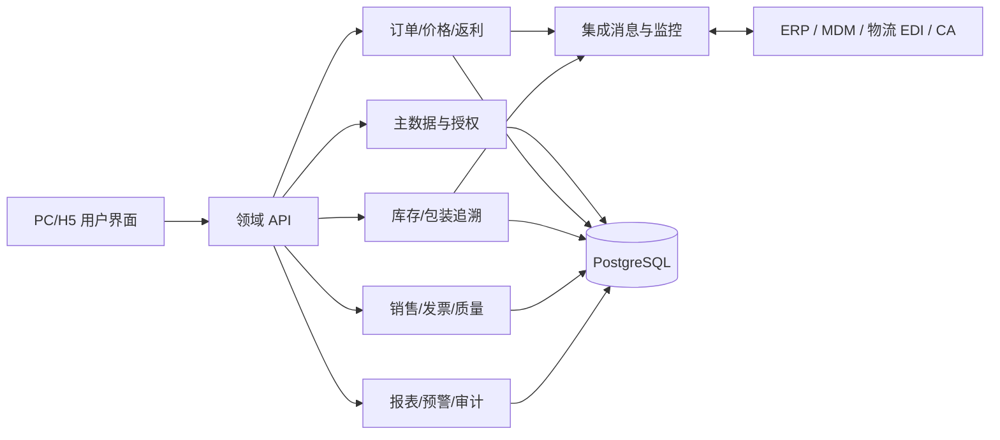

# DMS 功能与交互详细设计 v3.7

## 开发规格引用

本文件说明总体架构与模块设计；具体页面字段、校验顺序、接口入参、错误码和交付清单在《04_开发规格_页面字段接口_v3.7.md》中定义，应作为研发实施的直接依据。

## 1. 总体架构

系统维持前后端分离架构：Vue 3 + Element Plus 负责 PC 管理端和 H5 作业端；Spring Boot 按领域模块提供 REST API、异步任务和接口回调；PostgreSQL 保存业务数据、状态快照、操作日志和集成记录；对象存储保存合同、发票、植入单、质量资料等附件。现有 Docker Compose/Aliyun 部署保持为运行基线，生产接口和消息处理通过环境配置启用。

领域模块分为：认证与权限、主数据、合同授权、价格返利、订单、库存、销售报台、发票质量、报表预警、集成监控和系统管理。模块之间不得通过前端拼接数据替代领域接口；涉及库存、返利、订单状态和接口消息的写入需由服务端事务协调。

## 2. 共用技术与交互规范

### 2.1 页面骨架

PC 页面由全局顶栏、左侧菜单、页签栏、面包屑/标题区和内容区构成。一级菜单按“工作台、渠道与主数据、订单与履约、库存与追溯、销售与质量、报表与治理、系统管理”分组；菜单由后端配置和权限共同决定。用户切换菜单时保留已打开页签和已输入但未提交的筛选条件，关闭编辑页签时若有脏数据必须给出“保存草稿、放弃、取消”的三选项。

列表页严格使用以下结构：页面标题和主操作按钮；可折叠的条件筛选区；批量操作与已选数量；可配置列的数据表；汇总、分页和加载状态。复杂单据的新建/编辑使用全屏 Drawer，Drawer 内分“基本信息、明细、附件、审批/日志”等页签；禁止把超过 10 个字段的业务单据放进小型 Modal。

移动端只承载高频作业：工作台、扫码、收货/出库确认、手术报台和订单追溯。扫码页始终显示相机权限状态、当前操作类型、最近一次结果和人工输入入口；相机被拒绝时应引导用户前往系统设置或切换手工输入。

### 2.2 统一组件规则

| 组件 | 设计要求 | 业务约束 |
| --- | --- | --- |
| PickerInput | 弹出可搜索、可分页的选择面板，展示编码+名称+关键状态。 | 提交时传 ID；界面不得只显示 ID；选择结果失效时清空并提示。 |
| FilterBar | 支持关键词、枚举、多选、日期范围和高级筛选；显示已生效条件数量。 | 后端分页、排序和筛选参数必须统一；筛选条件可重置和保存。 |
| DataTable | 支持列显示、列头筛选、固定列、排序、空态和加载骨架。 | 批量操作仅作用于已勾选且有权限的记录；导出使用当前条件。 |
| FormSection | 以业务分组呈现字段，字段说明紧跟标签或帮助图标。 | 服务端返回字段级错误；错误定位至页签和字段，不能只弹全局报错。 |
| StatusBadge | 文字、语义颜色、图标共同表达状态。 | 颜色映射由字典统一维护，状态变更须可追溯。 |
| AttachmentPanel | 支持上传、预览、下载、版本和引用关系。 | 限制类型/大小；下载验证权限；删除附件仅逻辑删除并记录原因。 |
| Timeline | 用于订单、质量和接口事件。 | 显示操作者、时间、动作、意见和关联单据，不允许编辑历史事件。 |

视觉令牌以蓝色为主品牌、绿/橙/红/灰为语义色，采用 8pt 间距、统一圆角与轻阴影。正文、辅助文本、禁用态和边框使用固定中性色阶；焦点、错误和必填状态满足 WCAG AA 对比度。具体色值可在实施 UI Token 文件集中维护，页面不得自行硬编码近似色。

## 3. 数据模型与字段设计

### 3.1 新增/扩展核心实体

| 实体 | 关键字段 | 约束与说明 |
| --- | --- | --- |
| `hospital_product_lines` | hospital_id、product_line_id、status、effective_from/to、position_id | 有效期内医院+产品线不可重复；作为订单和报台校验依据。 |
| `sales_area_snapshots` | snapshot_month、version、source_version、status、created_by | 每月一主版本；修订以新 version 保存，不能覆盖原版本。 |
| `sales_area_snapshot_items` | snapshot_id、region_id、position_id、user_id、hospital_id、product_line_id | 存储历史归属展开记录，报表按发生日期关联。 |
| `product_kits` / `product_kit_items` | parent_product_id、pricing_mode、child_product_id、quantity、required、substitution_group | 子项数量大于零；固定项不可由普通用户删除。 |
| `rebate_pools` | dealer_id、bu_id、product_line_id、rule_id、period、opening、available、occupied、settled | `available + occupied` 与业务账本一致；所有变化写入明细。 |
| `rebate_ledger_entries` | pool_id、entry_type、amount、related_doc_type/id、idempotency_key | entry_type 为增加/占用/释放/核销/调整/冲回；幂等键唯一。 |
| `special_price_requests` | product_id、dealer_id、hospital_id、standard_price、requested_price、quantity_limit、effective_from/to、status | 申请价、有效期、数量均必填；批准后生成不可编辑额度快照。 |
| `repair_orders` | source_order_id、serial_no、fault_description、service_level、status、received_at、returned_at | 维修序列号与可售库存隔离；状态转移受限。 |
| `package_codes` | code、product_id、package_level、parent_code_id、status、owner_org_id | 码全局唯一；父子归属与状态必须一致。 |
| `quality_complaints` / `quality_capa_actions` | severity、product_id、lot_no、serial_no、due_at、root_cause、status | 关闭前 CAPA、复核及必填附件校验完成。 |
| `integration_messages` | system_code、message_type、direction、business_key、idempotency_key、payload_ref、status、retry_count | payload 脱敏后保存引用；业务键与幂等键用于重放防重。 |

### 3.2 状态机

**销售/采购订单：** `DRAFT → SUBMITTED → PENDING_APPROVAL → APPROVED → ERP_CONFIRMED → PARTIALLY_FULFILLED → FULFILLED → RECEIVED_CONFIRMED → CLOSED`。`SUBMITTED/PENDING_APPROVAL` 可退回至 `RETURNED`，再编辑后回到 `DRAFT`；未产生外部履约的单据可 `CANCELLED`；任何已结算金额修正须创建冲红/反向单，禁止直接回改。

**特殊价申请：** `DRAFT → SUBMITTED → APPROVING → APPROVED/REJECTED/RETURNED → EXPIRED/REVOKED/CONSUMED`。订单用量写入批准额度，额度达到上限转为 `CONSUMED`。

**维修单：** `DRAFT → TO_RECEIVE → RECEIVED → REPAIRING → QA_PENDING → TO_RETURN → RETURNED`，也可从 `REPAIRING/QA_PENDING` 转至 `SCRAPPED`。状态变更需要角色、时间和说明。

**质量投诉：** `DRAFT → OPEN → INVESTIGATING → CAPA_IN_PROGRESS → PENDING_REVIEW → CLOSED`；任何关闭项重新处理时转为 `REOPENED`，原关闭版本保留。

**集成消息：** `PENDING → SENDING → SUCCESS`，失败转为 `RETRYING`；达到上限后进入 `DEAD_LETTER`，人工处理后可 `REPLAYED`。重放时使用原业务幂等键，外部系统必须不重复创建业务单据。

## 4. 模块功能设计

### 4.1 价格、返利和特殊价

订单编辑页新增“价格构成”侧栏。用户选择经销商、医院、产品和数量后调用价格试算接口，返回命中规则、基础价、折扣、返利候选、税率、最终价和校验提示。页面只负责展示，最终金额在提交接口中再次由服务端计算并写入订单行快照。

返利池列表可按经销商、产品线、期间、规则和余额状态筛选。详情页分“余额概览、流水、关联订单、调整审批”四页签。占用/释放/核销使用数据库事务并在余额行上加并发锁；任何一次失败必须整体回滚，不得出现订单已批准而返利未占用的中间状态。

特殊价申请表单分为业务对象、价格影响、审批材料三组。系统实时显示标准价与申请价差额、折扣率、可用返利和最低价校验。通过的申请在订单选择器中显示“剩余额度/有效期”，超数量、超日期、客户不匹配或产品不匹配时不允许选择。

### 4.2 组套与维修

组套维护页左侧展示父品和版本，右侧展示子件表。子件字段包括 SKU、名称、固定/可选、数量、替代组、库存检查方式和生效期。发布组套前，系统检查不存在循环引用、子件有效、数量正确、同一替代组规则完整。订单行保存组套版本号，避免后续维护影响历史订单。

维修单从设备追溯页、销售单详情或维修列表发起。系统自动带出产品、序列号、原客户和原销售资料；操作员补充故障和收件资料。入库确认后创建维修库存流水，维修处理人只能改变维修状态，不能直接改变普通库存。返还或报废动作需生成对应出库/报废流水，并通知来源销售单的时间轴。

### 4.3 包装码、库存和追溯

包装码页面提供“码查询、聚合、解聚、收货扫描、出库扫描、异常处理”六个入口。聚合前要求所有子码处于同一组织、同一仓库、可用且未被其他父码占用；解聚后子码恢复独立状态。扫描接口必须一次性返回码的基础信息、父子树、库存状态、可执行动作及失败原因。

库存流水是不可变表，写入来源单据、动作、前后数量、前后状态、批号、序列号、包装码、组织、仓库、操作者和发生时间。库存调整页面不允许直接修改库存余额，而是创建调整申请；通过审批后生成正/负流水并更新汇总。产品流向页按批号、序列号或包装码生成树状时间轴，质量人员可一键创建同批次质量事件。

### 4.4 质量、销售与发票

质量投诉列表按等级、状态、产品、批号、责任部门、截止日期筛选，并将超期项置顶。详情采用“基本信息、调查、CAPA、受影响产品、附件、时间线”页签；关闭按钮仅在所有必填 CAPA 完成且复核人通过时可用。系统对严重等级事件可自动创建受影响库存清单和冻结建议，但实际冻结必须由具备库存权限的人员确认。

销售出库页先选择业务类型。医院销售时，医院、产品线和授权联动；选择批号/序列号后实时校验库存与是否受质量冻结影响。发票区可上传扫描件或批量导入，导入任务返回逐行匹配结果；冲红要求选择原发票、填写原因并自动建立负向关联，不允许删除原始记录。

## 5. 接口与异步设计

### 5.1 REST API 规范

API 使用 `/api/v1` 前缀，所有列表接口接受 `page`、`pageSize`、`sort` 和 `filters`，响应包含 `items`、`total`、`page`、`pageSize`。写接口要求 `Idempotency-Key`；服务端以“租户 + 用户 + 路径 + key”去重并返回首次处理结果。状态变更接口采用显式动作，如 `POST /orders/{id}/submit`、`POST /orders/{id}/approve`，禁止通用 PUT 绕过状态机。

关键接口包括：

- `POST /pricing/quote`：返回价格与返利试算，不产生账务。
- `GET/POST /rebate-pools`、`GET /rebate-pools/{id}/ledger`、`POST /rebate-pools/{id}/adjustments`：返利余额和调整。
- `POST /special-price-requests`、`POST /special-price-requests/{id}/submit|approve|reject`：特殊价流程。
- `GET/POST /product-kits`、`POST /repair-orders`、`POST /repair-orders/{id}/receive|return|scrap`：组套和维修。
- `POST /package-codes/aggregate|disaggregate|scan`、`GET /traceability`：包装码和追溯。
- `POST /quality-complaints`、`POST /quality-complaints/{id}/capa`、`POST /quality-complaints/{id}/close`：质量闭环。
- `GET /integrations/messages`、`POST /integrations/messages/{id}/replay`：接口监控与补偿。

### 5.2 外部集成

对 ERP、MDM、EDI 分别建立适配器，不在业务服务中硬编码 URL 或字段。业务事件先写本地 outbox，再由异步发布器发送外部消息；发送成功、失败、重试与人工重放都回写 `integration_messages`。入站消息先验签、去重、校验主数据映射，再写入领域服务；映射缺失时进入待处理队列而非静默丢弃。

集成监控页显示当日成功率、失败数、平均耗时、重试数和死信数，支持按系统、对象、业务单号和状态筛选。错误详情必须对令牌、手机号、病人信息和外部密钥脱敏；管理员只能下载已授权的原始报文。

## 6. 权限、审计与异常策略

接口先检查租户和功能权限，再按实体关系检查数据范围；导出、附件预览、接口重放和库存调整视为独立动作授权。审批人不得审批自己发起的特殊价、返利调整或质量关闭单；系统在服务端强制该隔离。

审计日志记录操作者、角色、IP/客户端、动作、实体、实体编号、前后关键字段、结果、失败原因、关联请求 ID 和时间。大字段与附件不直接写入日志，而是保存安全引用和摘要。日志查询支持按用户、实体、时间、动作和请求 ID 筛选，审计角色可导出并留下二次审计记录。

异常提示采用“用户可理解的原因 + 可执行的下一步 + 技术追踪号”格式。例如库存不足显示缺少的 SKU/批次/数量；接口失败显示可重试或联系管理员，不暴露堆栈。所有提交按钮必须防重复点击；网络超时后允许用户通过业务单据状态或请求 ID 查询是否已成功，避免盲目重复提交。

## 7. 测试与上线检查

每个模块至少覆盖：字段校验、状态机正反向流转、角色越权、数据隔离、并发幂等、附件权限、导入错误行、接口超时重试、操作日志和页面可访问性。库存、返利、包装码和接口重放需有事务/并发自动化测试；医院报台、质量投诉、特殊价审批需有端到端用例。

上线前依次执行数据库备份与迁移演练、接口沙箱联调、权限回归、性能压测、关键报表数据核对、监控告警演练和回滚演练。任何真实 ERP/EDI 接口在完成字段对账、失败补偿、幂等验证和负责人签字前，不得从 Mock 标记为生产可用。
