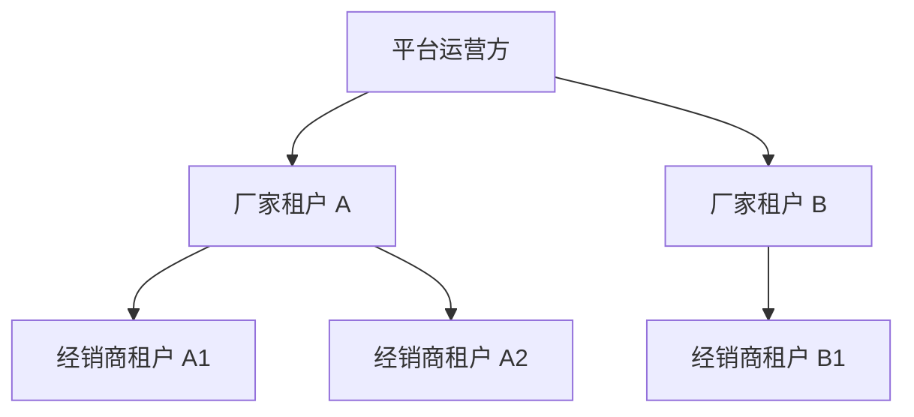

# 平台后台与多租户隔离需求范围总结

**版本**：v1.1  
**日期**：2026-08-02  
**适用系统**：通用 DMS 经销商管理系统  
**文档定位**：确认平台后台、多厂家多租户隔离、租户开通、权限、全局配置、日志中心、产品对码及前台功能迁移的需求边界。

---

## 1. 建设目标

DMS 采用 SaaS 化多租户架构，服务平台运营方、多个厂家以及各厂家下面的经销商。

1. 架构分为三层：平台运营方、厂家租户、经销商租户。
2. 平台运营方通过独立平台后台管理所有厂家租户、经销商租户、租户管理员、全局配置和全局日志。
3. 厂家租户和经销商租户使用统一业务前台，功能基本一致，通过租户类型、RBAC、岗位数据权限控制可见范围。
4. 一个厂家只能管理自己厂家租户内的数据，以及绑定到自己厂家下面的经销商租户关系；不能查看其他厂家或其他厂家经销商的数据。
5. 经销商租户只能访问自己的业务数据，不能访问厂家或其他经销商的数据。
6. `dealers` 始终是前台客户主数据表，不作为租户表；经销商租户通过绑定关系关联所属厂家租户下的一条 dealer 主数据。
7. 产品对码由厂家租户在前台维护，建立厂家产品与自己经销商产品之间的一对一关系，第一期主要服务报表汇总。
8. 默认采用共享部署的 SaaS 模式；对强隔离、强合规或深度定制客户，后续支持独立部署模式。

---

## 2. 三层架构与角色边界

平台运营方是系统提供方或 SaaS 运维方，负责管理所有厂家租户、经销商租户、全局配置和全局日志。厂家租户代表一个厂家，只能管理自己厂家租户内的数据以及归属自己的经销商租户关系。经销商租户代表某厂家下面的经销商，只能访问自己的业务数据。

---

## 3. 系统边界

### 3.1 平台后台

平台后台是独立 Web 应用，建议目录为 `admin-vue`，独立部署并使用独立入口。

平台后台负责：

- 后台管理员登录与退出。
- 厂家租户创建、停用、启用。
- 厂家租户管理员创建、停用、重置密码。
- 经销商租户创建、停用、启用。
- 经销商租户与所属厂家 dealer 主数据绑定。
- 经销商租户管理员账号创建、停用、重置密码。
- 默认角色、默认菜单、默认功能权限、默认数据权限配置。
- 全局字典、页面布局、字段显隐、筛选项配置。
- 租户菜单/模块授权。
- 全局操作日志、登录日志、接口日志、异常日志、慢接口日志查询。
- 接口原始请求/响应报文文件查看与下载。
- 租户开通默认配置管理。

平台后台不负责：

- 直接维护厂家或经销商的业务单据。
- 直接修改产品、库存、订单、合同、促销等业务数据。
- 模拟登录业务租户。
- 跨租户查看经销商真实业务数据。
- 维护租户内普通用户账号，该工作由租户管理员完成。

### 3.2 业务前台

业务前台由厂家租户和经销商租户共用。

业务前台保留：

- 租户内业务功能。
- 当前租户主数据维护。
- 订单、库存、采购、销售、手术报告、合同、促销、报表等业务操作。
- 租户管理员创建普通用户。
- 租户管理员自建角色、分配菜单/功能权限和数据权限、重置普通用户密码。
- 厂家租户维护产品对码。

业务前台不再承载平台级后台能力。现有集中式后台页面中的租户管理、全局字典、全局菜单、全局日志、全局系统参数、平台运维等能力迁移至平台后台。

---

## 4. 租户模型

### 4.1 租户类型

| 租户类型 | 编码建议 | 说明 |
|---|---|---|
| 厂家租户 | `MANUFACTURER` | 厂家自身业务空间，可存在多个 |
| 经销商租户 | `DEALER` | 每个经销商一个独立租户 |

厂家租户不再在设计上限定为唯一。平台后台可以创建多个厂家租户；第一期可以通过种子数据初始化一个默认厂家租户，但数据模型和权限设计必须支持多厂家。

### 4.2 租户主体

`tenants` 表作为真正的租户主体表，至少支持：租户编码、名称、类型、状态、联系人、模块授权、初始化配置、创建时间、更新时间、停用时间、启用时间。

第一期只做 `active` / `inactive` 手工停用启用，不做有效期自动到期。

### 4.3 租户与经销商绑定

`dealers` 表是客户主数据，不是租户表。每个厂家在自己的租户内维护自己的 dealer 主数据。

规则：

1. 一个经销商租户只能绑定厂家租户下的一个 dealer 主数据。
2. 一个 dealer 主数据同一时间只能绑定一个经销商租户。
3. 绑定在租户开通时建立。
4. 绑定后不支持随意解绑或换绑。
5. 如果绑定错误，只能停用错误租户，并重新创建正确租户进行绑定。
6. 每个租户只能有一个启用中的租户管理员账号。

建议新增 `tenant_dealer_bindings`，记录经销商租户 ID、厂家租户 ID、dealer ID、绑定状态、绑定时间、绑定操作人和备注。

### 4.4 租户状态

- `active`：可正常登录和使用。
- `inactive`：租户内所有用户不能登录，已有 token 立即失效。

停用不删除数据，重新启用后数据原样恢复。

---

## 5. 账号体系与登录

### 5.1 后台管理员

第一期平台后台只保留一个后台管理员角色，不做后台 RBAC 角色体系。

要求：

- 使用独立登录页、独立登录接口、独立 token。
- 账号通过初始化种子数据创建。
- 不进入业务前台。
- 所有写操作记录操作日志。

技术上可复用 `users` 表，但必须通过用户类型、独立登录入口和独立 token 与业务用户隔离。

### 5.2 租户管理员

每个租户有且只有一个启用中的租户管理员，由平台后台管理员创建。

职责：

- 登录业务前台。
- 创建、停用、解锁本租户普通用户。
- 重置本租户普通用户密码。
- 在平台授权范围内自建角色。
- 为角色分配菜单、按钮/功能权限和数据权限。
- 为用户分配角色。

租户管理员首次登录必须修改初始密码。

### 5.3 普通用户

普通用户由所属租户管理员创建和维护，后台管理员不直接创建普通用户。

- 后台管理员账号全局唯一。
- 业务前台用户按“租户编码 + 用户名”唯一。
- 用户只能访问所属租户数据。
- 用户停用后不能登录。

---

## 6. RBAC 与数据权限

### 6.1 权限原则

业务前台统一采用 RBAC：用户关联角色，角色关联菜单、按钮/功能权限和数据权限。用户拥有多个角色时，菜单权限和数据权限取并集。

前端控制展示，后端必须强制校验接口和数据范围。

### 6.2 默认角色

平台后台预设默认角色模板，租户开通时应用：

| 角色 | 适用租户 | 数据权限 |
|---|---|---|
| 厂家管理员 | 厂家租户 | 租户所有数据 |
| 厂家客服 | 厂家租户 | 租户所有数据 |
| 厂家销售 | 厂家租户 | 自己及下级岗位负责的经销商数据 |
| 经销商管理员 | 经销商租户 | 租户所有数据 |
| 经销商客服 | 经销商租户 | 租户所有数据 |
| 经销商销售 | 经销商租户 | 自己及下级岗位负责的客户数据 |

租户管理员可以自建角色，但可分配菜单和功能不能超过平台对该租户授权范围。

### 6.3 数据权限类型

第一期支持：

1. **租户所有数据**：查看当前租户内所有业务数据。
2. **自己创建的数据**：只查看自己创建或负责的数据。
3. **自己及下级岗位数据**：仅销售岗位适用，用户可查看自己岗位和下级岗位负责的经销商/客户数据。

现有岗位与经销商负责关系保持不变，不重新设计岗位模型。

### 6.4 作用范围

- 基础数据是否可见取决于角色是否拥有对应功能/菜单。
- 业务单据在功能可见基础上再按数据权限过滤。
- 销售订单、销退、出库、手术报告、合同、促销、经销商画像等按 dealer/customer 负责关系过滤。
- 采购、库存、基础档案等以菜单权限和租户隔离为准。
- 所有租户之间完全隔离。

---

## 7. 租户开通流程

### 7.1 厂家租户开通

平台后台创建厂家租户时完成：

1. 创建厂家租户。
2. 创建唯一厂家租户管理员账号和初始密码。
3. 应用厂家默认角色、默认菜单、默认功能权限、默认数据权限。
4. 加载全局字典。
5. 写入厂家租户开通审计日志。

### 7.2 经销商租户开通

平台后台创建经销商租户时完成：

1. 先选择所属厂家租户。
2. 从该厂家租户下选择一个未绑定的 dealer 主数据。
3. 创建经销商租户，并写入所属厂家租户 ID。
4. 建立经销商租户与该厂家 dealer 的一对一绑定。
5. 创建唯一经销商租户管理员账号和初始密码。
6. 应用经销商默认角色、默认菜单、默认功能权限、默认数据权限。
7. 加载全局字典。
8. 写入经销商租户开通审计日志。

开通时不自动创建仓库、组织、岗位、产品、库存、订单等业务数据。租户管理员首次登录必须修改密码。

---

## 8. 菜单、页面、字段与筛选配置

### 8.1 配置层级

第一期采用：全局默认配置 + 按租户类型差异配置。不做单租户自由布局，不做用户个性化布局。

### 8.2 菜单配置

平台后台配置菜单树、菜单编码、名称、图标、路由、排序、适用租户类型、启停状态和权限点。租户可使用菜单由平台授权决定。

### 8.3 页面字段配置

平台后台可配置字段是否显示、只读、必填、可导出。厂家租户可见字段范围大于等于经销商租户。

### 8.4 筛选配置

平台后台可配置列表筛选项是否显示、显示顺序、默认值、是否多选、是否参与导出。

### 8.5 发布与缓存

第一期配置保存后生效，不引入审批流。后端提供缓存刷新能力。

---

## 9. 全局字典

字典由平台后台统一维护，适用于所有租户。

- 第一期不启用租户私有字典。
- 不允许租户管理员新增或修改全局字典。
- 现有租户级字典设计需要收敛或标记不启用。
- 字典项支持启用、停用、排序。
- 字典变更后刷新缓存。

---

## 10. 产品对码

### 10.1 业务定位

厂家和经销商各自维护产品主数据。产品对码建立某厂家产品与该厂家下面某经销商产品之间的一对一关系，第一期主要服务报表汇总，不做跨租户业务单据查询。

### 10.2 维护入口

产品对码由厂家在业务前台维护，不放在平台后台。厂家只能选择归属自己的经销商租户进行对码，平台后台不维护具体业务对码数据。

### 10.3 对码规则

- 厂家产品与经销商产品必须一对一。
- 对码必须归属一个厂家租户和一个经销商租户。
- 厂家只能维护自己产品与归属自己的经销商产品之间的对码。
- 对码关系支持启用、停用。
- 停用对码不参与报表汇总。

建议对码表包含：厂家租户 ID、经销商租户 ID、厂家产品、经销商产品、包装单位、换算率、状态、导入批次、创建人、创建时间、更新时间。

### 10.4 Excel 导入

第一期支持 Excel 批量导入，流程为：下载模板、上传、解析预览、校验、展示成功和失败明细、下载错误报告、确认导入。

建议导入字段：经销商租户编码、经销商产品编码、厂家产品编码、包装单位、换算率、备注。

校验重点：经销商租户是否归属当前厂家、产品是否存在、编码是否重复、是否破坏一对一关系、租户是否有效、状态是否合法。

---

## 11. 多租户数据隔离

第一期采用共享数据库、共享 Schema、按 `tenant_id` 行级隔离的 SaaS 模式。所有租户业务表必须带 `tenant_id`。经销商租户还必须通过所属厂家字段或绑定关系明确归属厂家。

### 11.1 隔离原则

要求：

- 所有租户业务表必须带 `tenant_id`。
- 后端统一追加租户条件，不能信任前端传入租户 ID。
- 新增数据自动注入当前租户。
- 更新、删除必须校验租户。
- 平台级表、全局字典表、平台配置表明确加入白名单。
- 跨租户访问必须拒绝并记录安全日志。

### 11.2 技术要求

### 11.3 业务边界

- 经销商租户只能访问自己的业务数据。
- 厂家租户只能访问厂家自己的业务数据。
- 厂家不能查看经销商租户中的订单、库存、客户、报表等业务数据。
- 厂家租户中的 dealer 主数据只代表客户关系，不等同于经销商租户业务空间。
- 厂家不能访问其他厂家或其他厂家经销商的数据。

---

## 12. 部署模式

### 12.1 共享部署

默认模式为共享部署：多厂家、多租户共用一套应用和数据库，通过租户 ID、厂家归属字段和权限体系隔离数据；统一升级、统一运维、统一备份，适合小厂家和标准化业务场景。

### 12.2 独立部署

客户要求数据库物理隔离、强合规、独立域名、品牌定制、SSO、深度定制或独立升级窗口时，可采用独立部署。独立部署复用同一套代码和数据模型，但数据库、文件存储、域名和日志环境独立。

### 12.3 第一期策略

数据模型预留部署模式字段。第一期按共享部署实现，独立部署作为后续交付选项，不开发独立部署控制台。

---

## 13. 日志与监控

### 13.1 日志类型

平台后台提供全局日志中心：操作日志、登录日志、接口访问日志、异常日志、慢接口日志。

### 13.2 存储方式

接口日志采用“数据库存元数据 + MinIO 存原始报文文件”。

数据库记录：请求 ID、租户、用户、方法、路径、状态码、成功与否、耗时、IP、User-Agent、请求时间、异常摘要、请求文件地址、响应文件地址、文件大小。

列表支持按日志类型、租户、用户、路径、方法、状态码、成功与否、时间范围、请求 ID、耗时范围筛选。

### 13.3 报文与脱敏

- 原始请求和响应报文存储为文件。
- 文件上传、下载和二进制内容不存完整原文，只存元数据或截断摘要。
- 普通报文过长时截断并记录截断标记。
- 手机号、身份证脱敏。
- 认证字段、令牌、密钥等敏感字段必须强制脱敏。

### 13.4 保留周期

- 日志元数据保留 1 年。
- 原始报文文件保留 90 天。
- 异常日志可延长保留至 180 天。
- 超期数据由清理任务归档或删除。

### 13.5 监控范围

第一期做应用级日志，不把 CPU、内存、磁盘、Redis、数据库等基础设施监控纳入业务后台；基础设施监控后续可接 Prometheus/Grafana 或部署环境现有能力。

---

## 14. 测试数据范围

需要准备一批可演示和可联调的测试数据：

- 2 个厂家租户，体现多厂家 SaaS 场景。
- 每个厂家下 2 至 3 个经销商租户。
- 各经销商租户与所属厂家 dealer 主数据的绑定关系。
- 平台后台管理员、各厂家租户管理员、各经销商租户管理员。
- 厂家和经销商租户下的客服、销售账号。
- 岗位层级和岗位负责经销商/客户关系。
- 全局字典。
- 菜单、角色和权限模板。
- 厂家产品和经销商产品。
- 产品对码数据。
- 少量采购、销售、库存、手术报告等业务单据。
- 操作日志、登录日志、接口日志和异常日志样例。

测试数据建议通过 Flyway seed 脚本或独立 seed SQL 维护，便于开发、测试和演示环境重复初始化。

---

## 15. 前台功能迁移

现有前台中的平台后台能力需要抽离：

- 租户管理迁入平台后台。
- 全局字典迁入平台后台。
- 全局菜单、页面、字段、筛选配置迁入平台后台。
- 全局日志和运维能力迁入平台后台。
- 前台保留租户自己的用户管理、角色管理、权限分配和个人设置。
- 产品对码保留在厂家租户前台。
- 现有 `frontend-vue/src/views/Admin.vue` 中的平台能力废弃并迁移到独立 `admin-vue`。

---

## 16. 文档拆分计划

后续在 `docs/11_平台后台/` 下拆分详细文档：

1. `02_角色权限与RBAC设计.md`
2. `03_租户开通与经销商绑定.md`
3. `04_租户菜单与页面字段筛选配置.md`
4. `05_全局字典管理.md`
5. `06_产品主数据对码.md`
6. `07_日志审计与监控中心.md`
7. `08_数据库设计.md`
8. `09_API设计.md`
9. `10_前后台功能迁移清单.md`
10. `11_测试数据方案.md`

同时需要调整现有前台需求文档中混用的“后台管理”描述，明确区分为“平台后台”和“租户内管理”。

